<h2 style ="font-family: calibri ; text-align: center;"> LAPORAN PRAKTIKUM ALGORITMA DAN STRUKTUR DATA   DASAR PEMROGRAMAN</h2>

 

  Nama :Sesy Tana Lina Rahmatin
 
  Kelas :TI 1H
 
  NIM : 2341720029

-------------------------------------------
Percobaan 1:
 source code:
 public class ArrayObjects {
    public static class PersegiPanjang {
        public int panjang;
        public int lebar;
        }
        public static void main(String[] args) {
            PersegiPanjang[] ppArray = new PersegiPanjang[3];

            ppArray[0] = new PersegiPanjang();
            ppArray[0].panjang = 110;
            ppArray[0].lebar = 30;

            ppArray[1] = new PersegiPanjang();
            ppArray[1].panjang = 80;
            ppArray[1].lebar = 40;

            ppArray[2] = new PersegiPanjang();
            ppArray[2].panjang = 100;
            ppArray[2].lebar = 20;

            System.out.println("Persegi Panjang ke-0, panjang: " + ppArray[0].panjang + ", lebar: " + ppArray[0].lebar);
            System.out.println("Persegi Panjang ke-1, panjang: " + ppArray[1].panjang + ", lebar: " + ppArray[1].lebar);
            System.out.println("Persegi Panjang ke-2, panjang: " + ppArray[2].panjang + ", lebar: " + ppArray[2].lebar);
    }
}
Hasil Runing Program
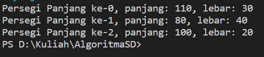

Pertanyaan
1.	Berdasarkan uji coba 3.2, apakah class yang akan dibuat array of object harus selalu memiliki atribut dan sekaligus method?Jelaskan!
= Tidak Selalu harus memiliki atribut dan method .namun jika ingin memberi nilai dari objek tersebut harus membuat atribut dalam classnya begitupun juga method harus dibuat jika memang diperlukan.
2.	Apakah class PersegiPanjang memiliki konstruktor?Jika tidak, kenapa dilakukan pemanggilan konstruktur pada baris program berikut :
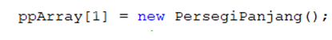
=Tidak,hal itu merupakan hal yang harus dilakukan sebuah objek meskipun classnya tidak memiliki konstruktor
3.	Apa yang dimaksud dengan kode berikut ini:
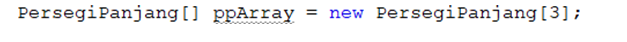
=instansiasi sebuah objek.
4.	Apa yang dimaksud dengan kode berikut ini:
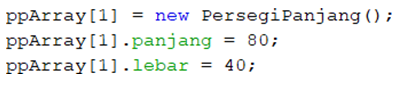
=Deklarasi atribut dan objek
5.	Mengapa class main dan juga class PersegiPanjang dipisahkan pada uji coba 3.2?
= meskipun dijadikan satu file sama saja,berbeda jika satu file tersebut dijadikan privat dalam satu file

Percobaan 2:
 source code:
 import java.util.Scanner;
public class ArrayObjects {
    public static class PersegiPanjang {
        public int panjang;
        public int lebar;
        }
        public static void main(String[] args) {
            PersegiPanjang[] ppArray = new PersegiPanjang[3];

            Scanner sc = new Scanner(System.in);

            for (int i = 0; i < 3; i++)
            {
                ppArray[i] = new PersegiPanjang(); 
                System.out.println("Persegi panjang ke-" + i);
                System.out.print("Masukkan panjang: "); 
                ppArray[i].panjang = sc.nextInt();
                System.out.print("Masukkan lebar: ");
                ppArray[i].lebar = sc.nextInt();
}
                for (int i = 0; i < 13; i++)
{
                    System.out.println("Persegi Panjang ke-" + 1);
                    System.out.println("Panjang: " + ppArray[i].panjang + ", lebar:" + ppArray[i].lebar);
    }
}
}

Hasil Runing Program
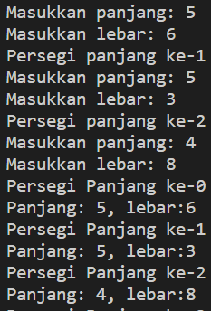

Pertanyaan
1.	Apakah array of object dapat diimplementasikan pada array 2 Dimensi?
=ya array of object dapat diimplementasikan pada array 2 dimensi .array 2 dimensi akan menjadi array dari objek objek yang mungkin memiliki atribut yang kompleks.
2.	Jika jawaban soal no satu iya, berikan contohnya! Jika tidak, jelaskan!
=contohnya pengelompokkan Mahasiswa berdasarkan ruang kelas artinya array 1 dimensi merupakan jumlah ruang kelas,kemudian array 2 dimensi merupakan jumlah mahasiswa setiap ruang kelas.
3.	Jika diketahui terdapat class Persegi yang memiliki atribut sisi bertipe integer, maka kode dibawah ini akan memunculkan error saat dijalankan. Mengapa?
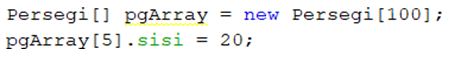
= karena tidak ada instansiasi objek persegi pada indeks ke 5
4.	Modifikasi kode program pada praktikum 3.3 agar length array menjadi inputan dengan Scanner!
=           System.out.println("Masukkan isi Array : ");
            int a = sc.nextInt();
            PersegiPanjang[] ppArray = new PersegiPanjang[a];
5.	Apakah boleh Jika terjadi duplikasi instansiasi array of objek, misalkan saja instansiasi dilakukan pada ppArray[i] sekaligus ppArray[0]?Jelaskan !
= boleh,jika kedua objek akan menjadi dua objek yang berbeda karena perbedaan nama saat instansiasi

Percobaan 3:
 source code:
 public class ArrayBalok {
    public static class Balok {
        public int panjang;
        public int lebar;
        public int tinggi;

        public Balok(int p, int l, int t) {
            panjang = p;
            lebar = l;
            tinggi = t;
        }

        public int hitungVolume() {
            return panjang * lebar * tinggi;
        }

        public static void main(String[] args) {
            Balok[] blArray = new Balok[3];

            blArray[0] = new Balok(100, 30, 12);
            blArray[1] = new Balok(120, 40, 15);
            blArray[2] = new Balok(210, 50, 25);

            for (int i = 0; i < 3; i++) {
                System.out.println("Volume balok ke " + i + ": " + blArray[i].hitungVolume());
            }
        }
    }
}

Hasil Runing Program
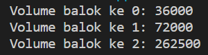

Pertanyaan
1.	Dapatkah konstruktor berjumlah lebih dalam satu kelas? Jelaskan dengan contoh!
=bisa,sebuah class memiliki lebih dari 1 konstruktor dan instansiasi objek akan menjalankan konstruktor dengan parameter sesuai dengan jumlah dan tipe datanya.
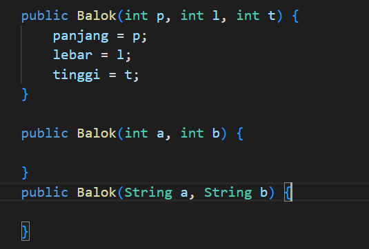
2.	Jika diketahui terdapat class Segitiga seperti berikut ini:
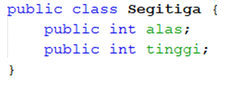
Tambahkan konstruktor pada class Segitiga tersebut yang berisi parameter int a, int t
yang masing-masing digunakan untuk mengisikan atribut alas dan tinggi.
jawab:
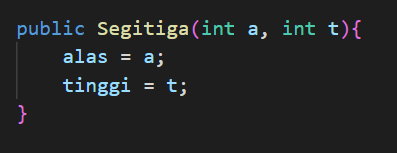
3.	Tambahkan method hitungLuas() dan hitungKeliling() pada class Segitiga tersebut. Asumsi segitiga adalah segitiga siku-siku. (Hint: Anda dapat menggunakan bantuan library Math pada Java untuk mengkalkulasi sisi miring)
jawab:
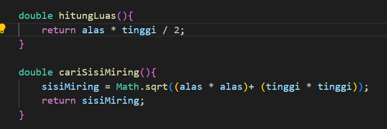
4.	Pada fungsi main, buat array Segitiga sgArray yang berisi 4 elemen, isikan masing-masing atributnya sebagai berikut:
sgArray ke-0	alas: 10, tinggi: 4
sgArray ke-1	alas: 20, tinggi: 10
sgArray ke-2	alas: 15, tinggi: 6
sgArray ke-3	alas: 25, tinggi: 10
jawab:
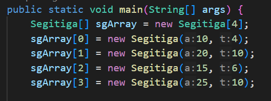
5.	Kemudian menggunakan looping, cetak luas dan keliling dengan cara memanggil method
hitungLuas() dan hitungKeliling().
jawab:
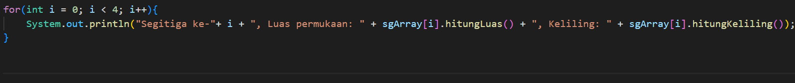

Latihan Praktikum
1.	Buatlah program yang dapat menghitung luas permukaan dan volume bangun ruang kerucut, limas segi empat sama sisi, dan bola. Buatlah 3 (tiga) class sesuai dengan jumlah jenis bangun ruang. Buatlah satu main class untuk membuat array of objects yang menginputkan atribut- atribut yang ada menggunakan konstruktor semua bangun ruang tersebut. Dengan ketentuan,
a.	Buat looping untuk menginputkan masing-masing atributnya, kemudian tampilkan luas permukaan dan volume dari tiap jenis bangun ruang tersebut.
b.	Pada kerucut, inputan untuk atribut hanya jari-jari dan sisi miring
c.	Pada limas segi empat sama sisi, inputan untuk atribut hanya panjang sisi alas dan tinggi limas
d.	Pada bola, inpuntan untuk atribut hanya jari-jari
kode program:
import java.util.Scanner;

public class Main {
    public static void main(String[] args) {
        Scanner sc = new Scanner(System.in);
        Scanner input = new Scanner(System.in);

        System.out.println("====================  Bangun Ruang Kerucut ====================");
        System.out.print("Masukkan jumlah kerucut: ");
        int i = sc.nextInt();
        kerucut[] kerucut = new kerucut[i];

       for(int j = 0; j < i; j++) {
            kerucut[j] = new kerucut();
            System.out.println("kerucut ke-" + j);
            System.out.print("Masukkan jari-jari:"); 
            kerucut[j].jariJari = input.nextDouble();
            System.out.print("Masukkan Sisi Miring: ");
            kerucut[j].sisiMiring = input.nextDouble();
        }

        for(int k = 0; k < i; k++){
            System.out.println("Kerucut ke-" + i + ", Luas Permukaan: " + kerucut[k].hitungLuasPermukaanKerucut() + ", Volume: " + kerucut[k].hitungVolumeKerucut());
        }

        System.out.println("====================  Bangun Ruang Limas Segi Empat ====================");
        System.out.print("Masukkan jumlah limas segi empat: ");
        int l = sc.nextInt();
        limasSegiEmpat [] limas = new limasSegiEmpat[i];

        for(int m = 0; m < l; m++){
            limas[m] = new limasSegiEmpat();
            System.out.println("Limas segi empat ke-" + m);
            System.out.print("Masukkan Panjang sisi alas: ");
            limas[m].panjangSisiAlas = input.nextDouble();
            System.out.print("Masukkan Tinggi Limas: ");
            limas[m].tinggiLimas = input.nextDouble();
        }

        for(int n = 0; n < l; n++){
            System.out.println("Limas Segi Empat ke-" + i + ", Luas Permukaan: " + limas[n]. hitungLuasPermukaanLimas() + ", Volume: " + limas[n].hitungVolumeLimas());
        }

        System.out.println("====================  Bangun Ruang Bola ====================");
        System.out.print("Masukkan jumlah bola: ");
        int x = sc.nextInt();
        Bola[] ball = new Bola[x];

        for(int y = 0; y < x; y++){
            ball[y] = new Bola();
            System.out.println("Bola ke-" + y);
            System.out.print("Masukkan Jari-jari: ");
            ball[y].jarijari = input.nextDouble();
        }

        for(int z = 0; z < x; z++){
            System.out.println("Bola ke-" + i + ", Luas Permukaan: " + ball[z].hitungLuasPermukaanBola() + ", Volume: " + ball[z].hitungVolumeBola());
        }
    }
}
hasil output:
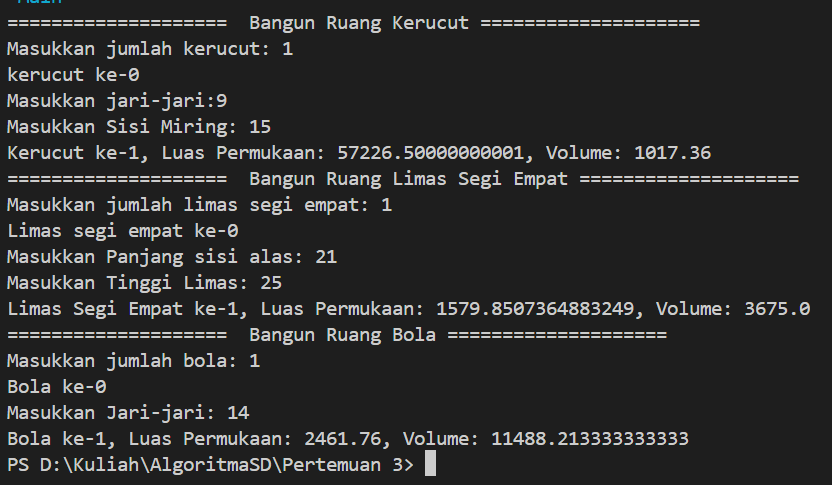
2.	Sebuah kampus membutuhkan program untuk menampilkan informasi mahasiswa berupa nama, nim, jenis kelamin dan juga IPK mahasiswa. Program dapat menerima input semua informasi tersebut, kemudian menampilkanya kembali ke user. Implementasikan program tersebut jika dimisalkan terdapat 3 data mahasiswa yang tersedia. Contoh output program:
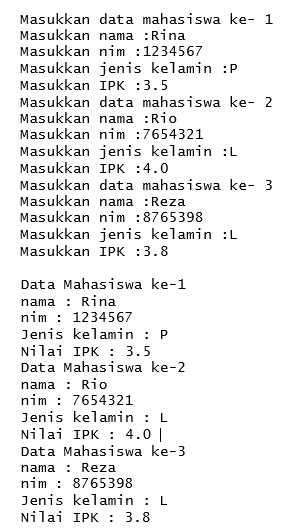
kode program:
public class Mhs {
    public String nama;
    public int nim;
    public char jK;
    public double ipk;

    double hitungRataRata(Mhs[] mahasiswa) {
        double total = 0;
        for (int i = 0; i < 3; i++) {
            total += mahasiswa[i].ipk;
        }
        return total / 3;
    }

    double cariIpkTerbesar(Mhs[] mahasiswa) {
        double besar = mahasiswa[0].ipk;
        for (int i = 0; i < 3; i++) {
            if (mahasiswa[i].ipk > besar) {
                besar = mahasiswa[i].ipk;
            }
        }
        return besar;
    }

    void tampilData(Mhs[] mahasiswa) {
        System.out.print("\n");
        
        for (int i = 0; i < 3; i++) {
            System.out.println("-------------------------");
            System.out.println("Data mahasiswa Ke-"+ (i+1));
            System.out.println("nama          : "+ mahasiswa[i].nama +"\nnim           : "+ mahasiswa[i].nim +"\nJenis kelamin : "+ mahasiswa[i].jK + "\nNilai IPK     : "+ mahasiswa[i].ipk);
        }
    }
}

output:
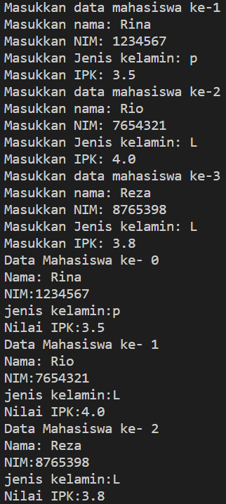
3.	Modifikasi program Latihan no.2 di atas, sehingga bisa digunakan untuk menghitung rata-rata IPK, serta menampilkan data mahasiswa dengan IPK terbesar! (gunakan method untuk masing-masing proses tersebut)
kode program:
import java.util.Scanner;

public class MhsMain {
    public static void main(String[] args) {
        Scanner sc = new Scanner(System.in);
        Mhs[] mahasiswa = new Mhs[3];

        for (int i = 0; i < 3; i++) {
            mahasiswa[i] = new Mhs();

            System.out.println("Masukkan data mahasiswa ke-"+ (i+1));
            System.out.print("Masukkan nama          : ");
            mahasiswa[i].nama = sc.nextLine();

            System.out.print("Masukkan NIM           : ");
            mahasiswa[i].nim = sc.nextInt();

            System.out.print("Masukkan jenis kelamin : ");
            mahasiswa[i].jK = sc.next().charAt(0);

            System.out.print("Masukkan IPK           : ");
            mahasiswa[i].ipk = sc.nextDouble();
            sc.nextLine();
        }
        
        Mhs mhs = new Mhs();
        mhs.tampilData(mahasiswa);
        System.out.print("\n");

        double rataRata = mhs.hitungRataRata(mahasiswa);
        System.out.println("-------------------------------------");
        System.out.printf("%-30s : %-4.2f","Rata-rata IPK mahasiswa adalah", rataRata);
        System.out.print("\n");

        double ipkBesar = mhs.cariIpkTerbesar(mahasiswa);
        System.out.println("-------------------------------------");
        System.out.println("IPK mahasiswa Terbesar adalah : "+ ipkBesar);
        System.out.println("-------------------------------------");

        sc.close();
    }
}
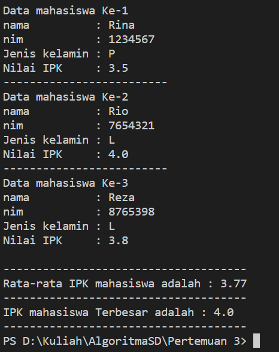

    

