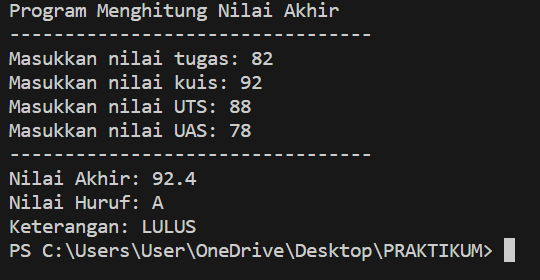
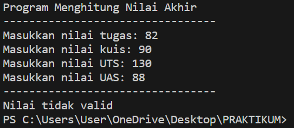
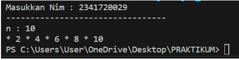
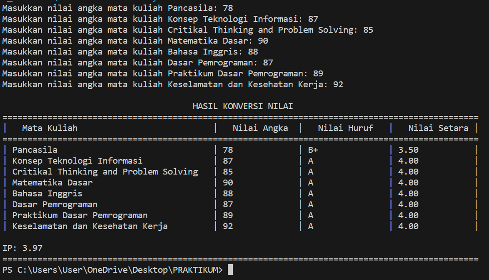
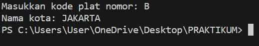
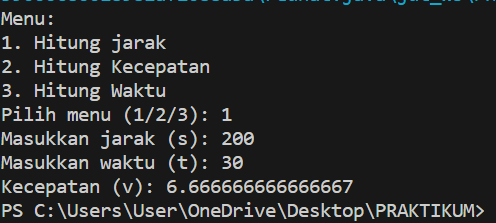

<h2 style ="font-family: calibri ; text-align: center;"> LAPORAN PRAKTIKUM ALGORITMA DAN STRUKTUR DATA   DASAR PEMROGRAMAN</h2>

-------------------------------------------

     
      
 Gambar 1. Output Pemilihan27.java

     
 Gambar 2. Output Pemilihan27.java

     
 Gambar 3. Output perulangan27.java

     
 Gambar 4. Output Array27.java

     
 Gambar 5. Output fungsi27.java

     
 Gambar 6. Output fungsi27.java

     
 Gambar 7. Output Tugas27.java

     
 Gambar 8. Output Tugas27.java

