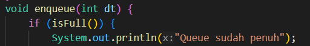

<h2 style ="font-family: calibri ; text-align: center;"> LAPORAN PRAKTIKUM ALGORITMA DAN STRUKTUR DATA   DASAR PEMROGRAMAN</h2>

 

  Nama :Sesy Tana Lina Rahmatin
 
  Kelas :TI 1H
 
  NIM : 2341720029

-------------------------------------------
Percobaan 1

Class Queue:
package Praktikum1;

    public class Queue27 {
        int[] data;
        int front;  
        int rear ;
        int size ;
        int max;

    public Queue27(int n) {
        max = n;
        data = new int[max];
        size = 0;
        front = rear = -1;
    }
        
    public boolean isEmpty() {
        if (size == 0) {
            return true;
        } else {
            return false;
        }
    }

    public boolean isFull() {
        if (size == max) {
            return true;
        } else {
            return false;
        }
    }

    void peek() {
        if (!isEmpty()) {
            System.out.println("Elemen terdepan : " + data[front]);
        } else {
            System.out.println("Queue masih kosong");
        }
    }
    
    void print() {
        if (isEmpty()) {
            System.out.println("Queue masih kosong");
        } else {
            int i = front;
            while (i != rear) {
                System.out.print(data[i] + " ");
                i = (i + 1) % max;
            }
            System.out.println(data[i] + " ");
            System.out.println("Jumlah elemen = " + size);
        }
    }
    
    void clear() {
        if (!isEmpty()) {
            front = rear = -1;
            size = 0;
            System.out.println("Queue berhasil dikosongkan");
        } else {
            System.out.println("Queue masih kosong");
        }
    }
    void enqueue(int dt) {
        if (isFull()) {
            System.out.println("Queue sudah penuh");
            System.exit(1);
        } else {
            if (isEmpty()) {
                front = rear = 0;
            } else {
                if (rear == max - 1) {
                    rear = 0;
                } else {
                    rear++;
                }
            }
            data[rear] = dt;
            size++;
        }
    }
    
    public int dequeue() {
        int dt = 0;
        if (isEmpty()) {
            System.out.println("Queue masih kosong");
            System.exit(1);
        } else {
            dt = data[front];
            size--;
            if (isEmpty()) {
                front = rear = -1;
            } else {
                if (front == max - 1) {
                    front = 0;
                } else {
                    front++;
                }
            }
        }
        return dt;
    }
}

Class Main:
package Praktikum1;

import java.util.Scanner;

public class Queue27Main {
    public static void menu() {
        System.out.println("Masukkan operasi yang diinginkan : ");
        System.out.println("1. Enqueue");
        System.out.println("2. Dequeue");
        System.out.println("3. Print");
        System.out.println("4. Peek");
        System.out.println("5. Clear");
        System.out.println("6. Keluar");
        System.out.println("----------------------------------");
    }

    public static void main(String[] args) {
        Scanner sc27 = new Scanner(System.in);
        System.out.print("Masukkan kapasitas queue : ");
        int n = sc27.nextInt();

        Queue27 Q = new Queue27(n);

        int pilih = 0;
        do {
            menu();
            pilih = sc27.nextInt();
            switch (pilih) {
                case 1:
                    System.out.print("Masukkan data baru : ");
                    int dataMasuk = sc27.nextInt();
                    Q.enqueue(dataMasuk);
                    break;
                case 2 :
                    int dataKeluar = Q.dequeue();
                    if (dataKeluar != 0) {
                        System.out.println("Data yang dikeluarkan : " + dataKeluar);
                    }
                    break;
                case 3 : 
                    Q.print();
                    break;
                case 4 : 
                    Q.peek();
                    break;
                case 5 : 
                    Q.clear();
                    break;
                default:
                    break;
            }
        } while (pilih == 1 || pilih == 2 || pilih == 3 || pilih == 4 || pilih == 5);
    }
}

Hasil Running:

Pertanyaan 
1.	Pada konstruktor, mengapa nilai awal atribut front dan rear bernilai -1, sementara atribut size bernilai 0? 
Jawab: Karena data dalam queue masih kosong, -1 digunakan sebagai penanda tidak ada indeks dalam queue kosong dengan size 0.
2.	Pada method Enqueue, jelaskan maksud dan kegunaan dari potongan kode berikut! 

Jawab:untuk Baris kode if (rear == max - 1) { rear = 0; } dalam method enqueue memiliki fungsi untuk mengecek apakah sudah mencapai batas maksimum dari antrian atau queue yang dimiliki. Jika sudah mencapai batas itu, yang berarti tidak ada tempat lagi untuk menambahkan elemen baru di bagian belakang antrian, maka kode ini akan membantu kita untuk kembali lagi ke bagian awal dari antrian. Dan jika bagian awal tersebut masih kosong, kita bisa menambah data baru di tempat rear ataupun di bagian awal.
3.	Pada method Dequeue, jelaskan maksud dan kegunaan dari potongan kode berikut! 

Jawab:jika sudah mencapai ujung antrian (kondisi front == max - 1), artinya front berada di akhir array. Dengan kode front = 0; front akan kembali ke awal array, sehingga kita dapat terus menggunakan ruang kosong di awal antrian setelah menghapus elemen-elemen.
4.	Pada method print, mengapa pada proses perulangan variabel i tidak dimulai dari 0 (int i=0), melainkan int i=front? 
Jawab: Karena dalam konsep queue, data yang masuk terlebih dahulu akan dikeluarkan terlebih dahulu, dan front merupakan indikasi data awal. Sedangkan data awal tidak selalu berada pada indeks ke 0.
5.	Perhatikan kembali method print, jelaskan maksud dari potongan kode berikut! 

Jawab: mencetak semua elemen antrian dalam urutan yang benar bahkan jika antrian tersebut menggunakan struktur data queue. Jika seumpama kita ingin mencetak indeks ke 0 setelah indeks terakhir, increment tersebut berguna untuk kasus itu.
6.	Tunjukkan potongan kode program yang merupakan queue overflow! 

7.	Pada saat terjadi queue overflow dan queue underflow, program tersebut tetap dapat berjalan dan hanya menampilkan teks informasi. Lakukan modifikasi program sehingga pada saat terjadi queue overflow dan queue underflow, program dihentikan! 
 void enqueue(int dt) {
        if (isFull()) {
            System.out.println("Queue sudah penuh");
            System.exit(1);
        } else {
            if (isEmpty()) {
                front = rear = 0;
            } else {
                if (rear == max - 1) {
                    rear = 0;
                } else {
                    rear++;
                }
            }
            data[rear] = dt;
            size++;
        }
    }
    
    public int dequeue() {
        int dt = 0;
        if (isEmpty()) {
            System.out.println("Queue masih kosong");
            System.exit(1);
        } else {
            dt = data[front];
            size--;
            if (isEmpty()) {
                front = rear = -1;
            } else {
                if (front == max - 1) {
                    front = 0;
                } else {
                    front++;
                }
            }
        }
        return dt;
    }

Percobaan 2
Class Nasabah:
package Praktikum2;

    public class Nasabah27{
        String norek, nama, alamat;
        int umur;
        double saldo;

        Nasabah27(){
        
        }

    Nasabah27(String norek, String nama, String alamat, int umur, double saldo){
        this.norek = norek;
        this.nama = nama;
        this.alamat = alamat;
        this.umur = umur;
        this.saldo = saldo;
    }
}

class Queue:
package Praktikum2;

public class Queue {
    Nasabah27[] data;
    int front, rear, size, max;

    Queue(int n) {
        max = n;
        data = new Nasabah27[max];
        size = 0;
        front = rear = -1;
    }

    public boolean isFull() {
        if (size == max) {
            return true;
        } else {
            return false;
        }
    }

    public boolean isEmpty() {
        if (size == 0) {
            return true;
        } else {
            return false;
        }
    }

    void enqueue(Nasabah27 dt) {
        if (isFull()) {
            System.out.println("Queue sudah penuh");
            System.exit(1);
        } else {
            if (isEmpty()) {
                front = rear = 0;
            } else {
                if (rear == max - 1) {
                    rear = 0;
                } else {
                    rear++;
                }
            }
            data[rear] = dt;
            size++;
        }
    }

    public Nasabah27 dequeue() {
        Nasabah27 dt = new Nasabah27();
        if (isEmpty()) {
            System.out.println("Queue masih kosong");
            System.exit(1);
        } else {
            dt = data[front];
            size--;
            if (isEmpty()) {
                front = rear = -1;
            } else {
                if (front == max - 1) {
                    front = 0;
                } else {
                    front++;
                }
            }
        }
        return dt;
    }

    void peek() {
        if (!isEmpty()) {
            System.out.println("Elemen terdepan : " + data[front].norek + " " + data[front].nama + " "
                    + data[front].alamat + " " + data[front].umur + " " + data[front].saldo);
        } else {
            System.out.println("Queue masih kosong");
        }
    }

    void peekRear() {
        if (!isEmpty()) {
            System.out.println("Elemen paling belakang : " + data[rear].norek + " " + data[rear].nama + " "
                    + data[rear].alamat + " " + data[rear].umur + " " + data[rear].saldo);
        } else {
            System.out.println("Queue masih kosong");
        }
    }
    
    void print() {
        if (isEmpty()) {
            System.out.println("Queue masih kosong");
        } else {
            int i = front;
            while (i != rear) {
                System.out.println(data[i].norek + " " + data[i].nama + " "
                        + data[i].alamat + " " + data[i].umur + " " + data[i].saldo);
                i = (i + 1) % max;
            }
            System.out.println(data[i].norek + " " + data[i].nama + " "
                    + data[i].alamat + " " + data[i].umur + " " + data[i].saldo);
            System.out.println("Jumlah elemen = " + size);
        }
    }

    void clear() {
        if (!isEmpty()) {
            front = rear = -1;
            size = 0;
            System.out.println("Queue berhasil dikosongkan");
        } else {
            System.out.println("Queue masih kosong");
        }
    }
}

class QueueMain:
package Praktikum2;

import java.util.Scanner;

public class QueueMain {
    public static void menu() {
        System.out.println("Pilih menu : ");
        System.out.println("1. Antrian baru");
        System.out.println("2. Antrian keluar");
        System.out.println("3. Cek antrian terdepan");
        System.out.println("4. Cek semua atrian");
        System.out.println("5. Keluar");
        System.out.println("----------------------------------");
    }

    public static void main(String[] args) {
        Scanner sc27 = new Scanner(System.in);
        Scanner sa = new Scanner(System.in);
        System.out.print("Masukkan kapasitas queue : ");
        int jumlah = sc27.nextInt();

        Queue Q = new Queue(jumlah);

        int pilih = 0;
        do {
            menu();
            pilih = sc27.nextInt();
            switch (pilih) {
                case 1:
                    System.out.print("No rekening : ");
                    String norek = sa.nextLine();
                    System.out.print("Nama : ");
                    String nama = sa.nextLine();
                    System.out.print("Alamat : ");
                    String alamat = sa.nextLine();
                    System.out.print("Umur : ");
                    int umur = sc27.nextInt();
                    System.out.print("Saldo : ");
                    int saldo = sc27.nextInt();
                    Nasabah27 nb = new Nasabah27(norek, nama, alamat, umur, saldo);
                    Q.enqueue(nb);
                    break;
                case 2:
                    Nasabah27 data = Q.dequeue();
                    if (!"".equals(data.norek) && !"".equals(data.nama) && !"".equals(data.alamat) && data.umur != 0
                            && data.saldo != 0) {
                        System.out.println("Data yang dikeluarkan : " + data.norek + " " + data.nama + " " + data.alamat
                                + " " + data.umur + " " + data.saldo);
                    }
                    break;
                case 3:
                    Q.peek();
                    break;
                case 4:
                    Q.print();
                    break;
                case 5:
                    Q.peekRear();
                    break;
                default:
                    break;
            }
        } while (pilih == 1 || pilih == 2 || pilih == 3 || pilih == 4 || pilih == 5);
    }
}
    
Hasil Running:

Pertanyaan 
1.	Pada class QueueMain, jelaskan fungsi IF pada potongan kode program berikut! 

Jawab:Memastikan bahwa data yang dikeluarkan dari queue setelah operasi dequeue adalah data yang valid dan tidak kosong, dan jika valid, data tersebut akan dicetak ke layar.
2.	Lakukan modifikasi program dengan menambahkan method baru bernama peekRear pada class Queue yang digunakan untuk mengecek antrian yang berada di posisi belakang! Tambahkan pula daftar menu 5. Cek Antrian paling belakang pada class QueueMain sehingga method peekRear dapat dipanggil! 
Class Queue:

Class Main:
package Praktikum2;
import java.util.Scanner;
public class QueueMain {
    public static void menu() {
        System.out.println("Pilih menu : ");
        System.out.println("1. Antrian baru");
        System.out.println("2. Antrian keluar");
        System.out.println("3. Cek antrian terdepan");
        System.out.println("4. Cek semua atrian");
        System.out.println("5. Cek antrian belakang");
        System.out.println("6. Keluar");
        System.out.println("----------------------------------");
    }

    public static void main(String[] args) {
        Scanner sc27 = new Scanner(System.in);
        Scanner sa = new Scanner(System.in);
        System.out.print("Masukkan kapasitas queue : ");
        int jumlah = sc27.nextInt();

        Queue Q = new Queue(jumlah);

        int pilih = 0;
        do {
            menu();
            pilih = sc27.nextInt();
            switch (pilih) {
                case 1:
                    System.out.print("No rekening : ");
                    String norek = sa.nextLine();
                    System.out.print("Nama : ");
                    String nama = sa.nextLine();
                    System.out.print("Alamat : ");
                    String alamat = sa.nextLine();
                    System.out.print("Umur : ");
                    int umur = sc27.nextInt();
                    System.out.print("Saldo : ");
                    int saldo = sc27.nextInt();
                    Nasabah27 nb = new Nasabah27(norek, nama, alamat, umur, saldo);
                    Q.enqueue(nb);
                    break;
                case 2:
                    Nasabah27 data = Q.dequeue();
                    if (!"".equals(data.norek) && !"".equals(data.nama) && !"".equals(data.alamat) && data.umur != 0
                            && data.saldo != 0) {
                        System.out.println("Data yang dikeluarkan : " + data.norek + " " + data.nama + " " + data.alamat
                                + " " + data.umur + " " + data.saldo);
                    }
                    break;
                case 3:
                    Q.peek();
                    break;
                case 4:
                    Q.print();
                    break;
                case 5:
                    Q.peekRear();
                    break;
                default:
                    break;
            }
        } while (pilih == 1 || pilih == 2 || pilih == 3 || pilih == 4 || pilih == 5);
    }
}

Tugas 
1. Buatlah program antrian untuk mengilustasikan pesanan disebuah warung. Ketika seorang pembeli akan mengantri, maka dia harus mendaftarkan nama, dan nomor HP seperti yang digambarkan pada Class diagram berikut: 

Class diagram Queue digambarkan sebagai berikut: 

Keterangan: 
•	Method create(), isEmpty(), isFull(), enqueue(), dequeue() dan print(), kegunaannya sama seperti yang telah dibuat pada Praktikum 
•	Method peek(): digunakan untuk menampilkan data Pembeli yang berada di posisi antrian paling depan 
•	Method peekRear(): digunakan untuk menampilkan data Pembeli yang berada di posisi antrian paling belakang 
•	Method peekPosition(): digunakan untuk menampilkan seorang pembeli (berdasarkan nama) posisi antrian ke berapa 
•	Method daftarPembeli(): digunakan untuk menampilkan data seluruh pembeli  

Hasil Running:

