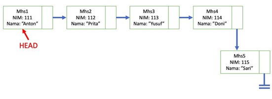

<h2 style ="font-family: calibri ; text-align: center;"> LAPORAN PRAKTIKUM ALGORITMA DAN STRUKTUR DATA   DASAR PEMROGRAMAN</h2>

 

  Nama :Sesy Tana Lina Rahmatin
 
  Kelas :TI-1H
 
  NIM : 2341720029

---------------------------------------------------------------------------------------------------------------------------------------------------
Percobaan 1

Class Node:
package minggu11;

public class Node {
        int data;
        Node next;
    
        public Node(int data, Node next) {
            this.data = data;
            this.next = next;
        }
    }

class SingleLinkedList:
package minggu11;

public class SingleLinkedList {
        Node head, tail;
    
        boolean isEmpty() {
            return head != null;
        }
    
        void print() {
            if (isEmpty()) {
                Node tmp = head;
                System.out.print("Isi Linked List:\t");
                while (tmp != null) {
                    System.out.print(tmp.data + " \t");
                    tmp = tmp.next;
                }
                System.out.println();
            } else {
                System.out.println("Linked List kosong");
            }
        }
    
        void addFirst(int input) {
            Node ndInput = new Node(input, null);
            if (isEmpty()) {
                ndInput.next = head;
                head = ndInput;
            } else {
                head = ndInput;
                tail = ndInput;
            }
        }
    
        void addLast(int input) {
            Node ndInput = new Node(input, null);
            if (isEmpty()) {
                tail.next = ndInput;
                tail = ndInput;
            } else {
                head = ndInput;
                tail = ndInput;
            }
        }
    
        void insertAfter(int key, int input) {
            Node ndInput = new Node(input, null);
            Node temp = head;
            do {
                if (temp.data == key) {
                    ndInput.next = temp.next;
                    temp.next = ndInput;
                    if (ndInput.next == null) {
                        tail = ndInput;
                    }
                    break;
                }
                temp = temp.next;
            } while (temp != null);
        }
    
        void insertAt(int index, int input) {
            if (index < 0) {
                System.out.println("Indeks salah");
            } else if (index == 0) {
                addFirst(input);
            } else {
                Node temp = head;
                for (int i = 0; i < index - 1; i++) {
                    temp = temp.next;
                }
                temp.next = new Node(input, temp.next);
                if (temp.next.next == null) {
                    tail = temp.next;
                }
            }
        }
    }

Class SLLMain:
package minggu11;

public class SLLMain {
        public static void main(String[] args) {
            SingleLinkedList singLL = new SingleLinkedList();
            singLL.print();
            singLL.addFirst(890);
            singLL.print();
            singLL.addLast(760);
            singLL.print();
            singLL.addFirst(700);
            singLL.print();
            singLL.insertAfter(700, 999);
            singLL.print();
            singLL.insertAt(3, 833);
            singLL.print();
        }
    }

Hasil Running:

  
Pertanyaan 
1.	Mengapa hasil compile kode program di baris pertama menghasilkan “Linked List Kosong”? 
= Karena belum ada yang ditambahkan pada list
2.	Jelaskan kegunaan variable temp secara umum pada setiap method! 
= temp digunakan untuk menunjukkan node sementara yang merupakan singkatan dari temporary
3.	Perhatikan class SingleLinkedList, pada method insertAt Jelaskan kegunaan kode berikut  

=kode diatas digunakan untuk mengecek apakah node yang akan ditambahkan merupakan node terakhir.

Percobaan 2

Class Node:
package Percobaan2;

public class Node {
    int data;
    Node next;

    public Node(int data, Node next) {
        this.data = data;
        this.next = next;
    }
}

Class SingleLinkedList:
package Percobaan2;

public class SingleLinkedList {
    Node head, tail;

    boolean isEmpty() {
        return head != null;
    }

    void print() {
        if (isEmpty()) {
            Node tmp = head;
            System.out.print("Isi Linked List:\t");
            while (tmp != null) {
                System.out.print(tmp.data + " \t");
                tmp = tmp.next;
            }
            System.out.println();
        } else {
            System.out.println("Linked List kosong");
        }
    }

    void addFirst(int input) {
        Node ndInput = new Node(input, null);
        if (isEmpty()) {
            ndInput.next = head;
            head = ndInput;
        } else {
            head = ndInput;
            tail = ndInput;
        }
    }

    void addLast(int input) {
        Node ndInput = new Node(input, null);
        if (isEmpty()) {
            tail.next = ndInput;
            tail = ndInput;
        } else {
            head = ndInput;
            tail = ndInput;
        }
    }

    void insertAfter(int key, int input) {
        Node ndInput = new Node(input, null);
        Node temp = head;
        do {
            if (temp.data == key) {
                ndInput.next = temp.next;
                temp.next = ndInput;
                if (ndInput.next == null) {
                    tail = ndInput;
                }
                break;
            }
            temp = temp.next;
        } while (temp != null);
    }

    void insertAt(int index, int input) {
        if (index < 0) {
            System.out.println("Indeks salah");
        } else if (index == 0) {
            addFirst(input);
        } else {
            Node temp = head;
            for (int i = 0; i < index - 1; i++) {
                temp = temp.next;
            }
            temp.next = new Node(input, temp.next);
            if (temp.next.next == null) {
                tail = temp.next;
            }
        }
    }

    int getData(int index) {
        if (index < 0) {
            System.out.println("Indeks salah");
            return -1;
        } else {
            Node temp = head;
            for (int i = 0; i < index; i++) {
                temp = temp.next;
            }
            return temp.data;
        }
    }

    int indexOf(int key) {
        Node temp = head;
        int index = 0;
        while (temp != null && temp.data != key) {
            temp = temp.next;
            index++;
        }
        if (temp != null) {
            return index;
        } else {
            return -1;
        }
    }

    void removeFirst() {
        if (isEmpty()) {
            head = head.next;
        } else if (head == tail) {
            head = tail = null;
        } else {
            System.out.println("Linked List kosong");
        }
    }

    void removeLast() {
        if (isEmpty()) {
            Node temp = head;
            while (temp.next != tail) {
                temp = temp.next;
            }
            temp.next = null;
            tail = temp;
        } else if (head == tail) {
            head = tail = null;
        } else {
            System.out.println("Linked List kosong");
        }
    }

    void remove(int key) {
        if (isEmpty()) {
            Node temp = head;
            while (temp != null) {
                if (temp.data == key && temp == head) {
                    removeFirst();
                    break;
                } else if (temp.next.data == key) {
                    temp.next = temp.next.next;
                    if (temp.next == null) {
                        tail = temp;
                    }
                    break;
                }
                temp = temp.next;
            }
        } else {
            System.out.println("Linked List kosong");
        }
    }

    void removeAt(int index) {
        if (index < 0) {
            System.out.println("Indeks salah");
        } else if (index == 0) {
            removeFirst();
        } else {
            Node temp = head;
            for (int i = 0; i < index - 1; i++) {
                temp = temp.next;
            }
            temp.next = temp.next.next;
            if (temp.next == null) {
                tail = temp;
            }
        }
    }
}

Class SLLMain:
package Percobaan2;

public class SLLMain {
    public static void main(String[] args) {
        SingleLinkedList singLL = new SingleLinkedList();
        singLL.print();
        singLL.addFirst(890);
        singLL.print();
        singLL.addLast(760);
        singLL.print();
        singLL.addFirst(700);
        singLL.print();
        singLL.insertAfter(700, 999);
        singLL.print();
        singLL.insertAt(3, 833);
        singLL.print();

        System.out.println("Data pada indeks ke-1: " + singLL.getData(1));
        System.out.println("Data 3 berada pada indeks ke-" + singLL.indexOf(760));

        singLL.remove(999);
        singLL.print();
        singLL.removeAt(0);
        singLL.print();
        singLL.removeFirst();
        singLL.print();
        singLL.removeLast();
        singLL.print();
    }
}

Hasil Runing:

PERTANYAAN
1.	Mengapa digunakan keyword break pada fungsi remove? Jelaskan! 
=break digunakan untuk menghentikan kode setelah suatu kondisi terpenuhi.
2.	Jelaskan kegunaan kode dibawah pada method remove 

=kode diatas digunakan untuk menghapus node yang sesuai dengan key dengan melewatkan node yang ingin dihapus .

Tugas
1.	Implementasikan ilustrasi Linked List Berikut. Gunakan 4 macam penambahan data yang telah dipelajari sebelumnya untuk menginputkan data. 

Jawaban=
Class Mahasiswa:
package Tugas1;

public class Mahasiswa {
    int nim;
    String nama;

    public Mahasiswa(int nim, String nama) {
        this.nim = nim;
        this.nama = nama;
    }

    public String toString() {
        return "Mhs{" +
                "nim=" + nim +
                ", nama='" + nama + '\'' +
                '}';
    }
}

Class Node:
package Tugas1;

public class Node {
    Mahasiswa data;
    Node next;

    public Node(Mahasiswa data, Node next) {
        this.data = data;
        this.next = next;
    }
}

Class SingleLinkedList:
package Tugas1;

public class SingleLinkedList {
    Node head, tail;

    boolean isEmpty() {
        return head != null;
    }

    void print() {
        if (isEmpty()) {
            Node tmp = head;
            System.out.print("Isi Linked List:\t");
            while (tmp != null) {
                System.out.print(tmp.data + " \t");
                tmp = tmp.next;
            }
            System.out.println();
        } else {
            System.out.println("Linked List kosong");
        }
    }

    void addFirst(Mahasiswa input) {
        Node ndInput = new Node(input, null);
        if (isEmpty()) {
            ndInput.next = head;
            head = ndInput;
        } else {
            head = ndInput;
            tail = ndInput;
        }
    }

    void addLast(Mahasiswa input) {
        Node ndInput = new Node(input, null);
        if (isEmpty()) {
            tail.next = ndInput;
            tail = ndInput;
        } else {
            head = ndInput;
            tail = ndInput;
        }
    }

    void insertAfter(int key, Mahasiswa input) {
        Node ndInput = new Node(input, null);
        Node temp = head;
        do {
            if (temp.data.nim  == key) {
                ndInput.next = temp.next;
                temp.next = ndInput;
                if (ndInput.next == null) {
                    tail = ndInput;
                }
                break;
            }
            temp = temp.next;
        } while (temp != null);
    }

    void insertAfter(String key, Mahasiswa input) {
        Node ndInput = new Node(input, null);
        Node temp = head;
        do {
            if (temp.data.nama.equals(key)) {
                ndInput.next = temp.next;
                temp.next = ndInput;
                if (ndInput.next == null) {
                    tail = ndInput;
                }
                break;
            }
            temp = temp.next;
        } while (temp != null);
    }

    void insertAt(int index, Mahasiswa input) {
        if (index < 0) {
            System.out.println("Indeks salah");
        } else if (index == 0) {
            addFirst(input);
        } else {
            Node temp = head;
            for (int i = 0; i < index - 1; i++) {
                temp = temp.next;
            }
            temp.next = new Node(input, temp.next);
            if (temp.next.next == null) {
                tail = temp.next;
            }
        }
    }
}

Class SLLMain:
package Tugas1;

public class SLLMain {
    public static void main(String[] args) {
        SingleLinkedList singLL = new SingleLinkedList();
        singLL.print();
        singLL.addLast(new Mahasiswa(115, "Sari"));
        singLL.print();
        singLL.addFirst(new Mahasiswa(111, "Anton"));
        singLL.print();
        singLL.insertAfter(111, new Mahasiswa(112, "Prita"));
        singLL.print();
        singLL.insertAt(2, new Mahasiswa(113, "Yusuf"));
        singLL.print();
        singLL.insertAfter("Yusuf", new Mahasiswa(114, "Doni"));
        singLL.print();
    }
}

Hasil Running:

2.	Buatlah implementasi program antrian layanan unit kemahasiswaan sesuai dengan kondisi yang ditunjukkan pada soal nomor 1! Ketentuan 
a.	Implementasi antrian menggunakan Queue berbasis Linked List! 
b.	Program merupakan proyek baru, bukan modifikasi dari soal nomor 1! 
Jawaban=

Class Mahasiswa:
package Tugas2;

public class Mahasiswa {
    int nim;
    String nama;

    public Mahasiswa(int nim, String nama) {
        this.nim = nim;
        this.nama = nama;
    }

    public String toString() {
        return "Mhs{" +
                "nim=" + nim +
                ", nama='" + nama + '\'' +
                '}';
    }
}

Class Node:
package Tugas2;

public class Node {
    Mahasiswa data;
    Node next;

    public Node(Mahasiswa data, Node next) {
        this.data = data;
        this.next = next;
    }
}

Class SingleLinkedQueue:
package Tugas2;

public class SingleLinkedQueue {
    Node head, tail;

    boolean isEmpty() {
        return head == null;
    }

    void print() {
        if (isEmpty()) {
            System.out.println("Linked Queue kosong");
        } else {
            Node tmp = head;
            System.out.print("Isi Linked Queue:\t");
            while (tmp != null) {
                System.out.print(tmp.data + " \t");
                tmp = tmp.next;
            }
            System.out.println();
        }
    }

    void enqueue(Mahasiswa input) {
        Node ndInput = new Node(input, null);
        if (isEmpty()) {
            head = ndInput;
            tail = ndInput;
        } else {
            tail.next = ndInput;
            tail = ndInput;
        }
    }

    Mahasiswa dequeue() {
        if (isEmpty()) {
            return null;
        } else {
            Mahasiswa tmp = head.data;
            head = head.next;
            return tmp;
        }
    }

    void peek() {
        if (isEmpty()) {
            System.out.println("Antrian masih kosong");
        } else {
            System.out.println("Elemen terdepan: " + head.data);
        }
    }

    void clear() {
        if (isEmpty()) {
            System.out.println("Antrian masih kosong");
        } else {
            head = tail = null;
        }
    }

    void peekRear() {
        if (isEmpty()) {
            System.out.println("Antrian masih kosong");
        } else {
            System.out.println("Elemen terbelakang: " + tail.data);
        }
    }
}

Class SLQMain:
package Tugas2;

public class SLQMain {
    public static void main(String[] args) {
        SingleLinkedQueue singLQ = new SingleLinkedQueue();
        singLQ.print();
        singLQ.enqueue(new Mahasiswa(111, "Anton"));
        singLQ.print();
        singLQ.enqueue(new Mahasiswa(112, "Prita"));
        singLQ.print();
        singLQ.enqueue(new Mahasiswa(113, "Yusuf"));
        singLQ.print();
        singLQ.enqueue(new Mahasiswa(114, "Doni"));
        singLQ.print();
        singLQ.enqueue(new Mahasiswa(115, "Sari"));
        singLQ.print();
        singLQ.peek();

        System.out.println("==================================");

        Mahasiswa dequeue = singLQ.dequeue();
        System.out.println("Elemen yang di-dequeue: " + dequeue);
        dequeue = singLQ.dequeue();
        System.out.println("Elemen yang di-dequeue: " + dequeue);

        System.out.println("==================================");

        singLQ.print();

        System.out.println("==================================");
        singLQ.peek();
        singLQ.peekRear();
    }
}

Hasil Running

