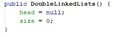

<h2 style ="font-family: calibri ; text-align: center;"> LAPORAN PRAKTIKUM ALGORITMA DAN STRUKTUR DATA   DASAR PEMROGRAMAN</h2>

 

  Nama :Sesy Tana Lina Rahmatin
 
  Kelas :TI-1H
 
  NIM : 2341720029

--------------------------------------------------------------------------------------------------------------------------
Percobaan 1

Hasil Running:

Pertanyaan
1.	Jelaskan perbedaan antara single linked list dengan double linked lists! 
Jawaban:Single Linked hanya memiliki 1 pointer yaitu next,sedangkan Double Linked memiliki 2 pointer yanitu next dan prev.
2.	Perhatikan class Node, di dalamnya terdapat atribut next dan prev. Untuk apakah atribut tersebut? 
Jawaban:Atribut next digunakan untuk menunjuk node berikutnya dalam linked list,sedangkan atribut prev digunakan untuk menunjukkan kode sebelumnya dalam linked.
3.	Perhatikan konstruktor pada class DoubleLinkedLists. Apa kegunaan inisialisasi atribut head dan size seperti pada gambar berikut ini? 

Jawaban:inisialisasi atribut head digunakan untuk menunjukkan bahwa linked list tidak terisi node apapun sehingga head diatur sebagai nul.sedangkan size digunakan untuk menunjukkan bahwa linked list tidak memiliki elemen apapun.
4.	Pada method addFirst(), kenapa dalam pembuatan object dari konstruktor class Node prev dianggap sama dengan null? 
Node newNode = new Node(null, item, head); 
Jawaban:karena prev dari node pertama akan selalu null,jika akan menambahkan node pertama maka harus mengatur agar prev node tersebut menjadi null.
5.	Perhatikan pada method addFirst().  Apakah arti statement head.prev = newNode ? 
Jawaban:head.prev = digunakan untuk mengatur head.prev yang sebelumnya mengarah ke null menjadi ke node baru.
6.	Perhatikan isi method addLast(), apa arti dari pembuatan object Node dengan mengisikan parameter prev dengan current, dan next dengan null? 
Node newNode = new Node(current, item, null); 
Jawaban: Mengisis prev dengan cureent digunakan untuk membuat prev dari node baru menjadi node terakhr saat ini dan next node baru menjadi null
7.	Pada method add(), terdapat potongan kode program sebagai berikut: 

jelaskan maksud dari bagian yang ditandai dengan kotak kuning. 
Jawaban:blok kode tersebut digunakan jika current berada diawal list dengan membuat newNode dengan prev newnode adalah null dan next nya merupakan node pertama saat ini.

Percobaan 2

Hasil Running:

Pertanyaan 
1.	Apakah maksud statement berikut pada method removeFirst()? 
head = head.next; head.prev = null; 
Jawaban:Digunakan untuk mengubah head yang sekarang menjadi head yang selanjutnya,sehingga head yang sekarang akan hilang.
2.	Bagaimana cara mendeteksi posisi data ada pada bagian akhir pada method removeLast()? 
Jawaban:posisi data bagian akhir dideteksi dengan menggunakan perulangan while untuk menulusuri linked list sampai ke node terakhir.
3.	Jelaskan alasan potongan kode program di bawah ini tidak cocok untuk perintah remove! 

Jawaban:kode program diatas tidak cocok untuk perintah remode  karena kode tersebut untuk menghapus node dari linked list tanpa memeriksa node yang akan dihapus.
4.	Jelaskan fungsi kode program berikut ini pada fungsi remove! 

Jawaban:kode program diatas berfungsi untuk mengatur pointer next dari node yang sebelumnya menjadi next setelah node yang akan dihapus.

Percobaan 3

Hasil Running:

Pertanyaan
1.	Jelaskan method size() pada class DoubleLinkedLists! 
Jawaban:size() digunakan untuk mereturn berapa jumlah node dalam linked list.
2.	Jelaskan cara mengatur indeks pada double linked lists supaya dapat dimulai dari indeks ke- 1!
Jawaban: untuk mengatur indeks dimulai dari 1 pada double linked lists,cukup atur iterasi dan mengubah pointer pada method add() dan get().
3.	Jelaskan perbedaan karakteristik fungsi Add pada Double Linked Lists dan Single Linked Lists!  
Jawaban:Single Linked Lists hanya perlu mengubah 1 pointer saja (next) sedangkan Double Linked Lists mengubah 2 pointer sehingga menjadi lebih kompleks.
4.	Jelaskan perbedaan logika dari kedua kode program di bawah ini! 

Jawaban:kode auntuk mengecek apakah list kosng berdasarkan banyak node yang ada.sementara kode b untuk memeriksa kekosongan berdasarkan node pertama/head.

Tugas:
1.Buat program antrian vaksinasi menggunakan queue berbasis double linked list sesuai ilustrasi dan menu di bawah ini! (counter jumlah antrian tersisa di menu cetak(3) dan data orang yang telah divaksinasi di menu Hapus Data(2) harus ada)  
Hasil Running:

2.Buatlah program daftar film yang terdiri dari id, judul dan rating menggunakan double linked lists, bentuk program memiliki fitur pencarian melalui ID Film dan pengurutan Rating secara descending.

