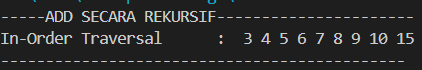

<h2 style ="font-family: calibri ; text-align: center;"> LAPORAN PRAKTIKUM ALGORITMA DAN STRUKTUR DATA   DASAR PEMROGRAMAN</h2>

 

  Nama :Sesy Tana Lina Rahmatin
 
  Kelas :TI-1H
 
  NIM : 2341720029

--------------------------------------------------------------------------------------------------------------------------

Percobaan 1

Hasil Running:

Pertanyaan 
1.	Mengapa dalam binary search tree proses pencarian data bisa lebih efektif dilakukan dibanding binary tree biasa? 
jawab: karena Binary search tree yang memungkinkan pengurangan ruang pencarian secara signifikan disetiap langkah pembuatan proses pencarian dalam Binary search tree lebih efisien dibandingkan dengan binary tree biasa.

2.	Untuk apakah di class Node, kegunaan dari atribut left dan right? 
jawab: atribut 'left' dan 'right' pada kelas 'node' memungkinkan pembentukan dan navigasi struktur biner dengan menyimpan referensi ke kiri dan ke kanan,yang merupakan dasar dari operasi dasar biner.

3. a. Untuk apakah kegunaan dari atribut root di dalam class BinaryTree? 
jawab:digunakan sebagai titik masuk untuk semua operasi,termasuk penyisipan 'insert' dan pencarian 'search'.
  b. Ketika objek tree pertama kali dibuat, apakah nilai dari root? 
jawab: nilai dari atribut 'root' adalah 'None' ini menunjukkan bahwa pohon tersebut masih kosong dan belum memiliki node apapun.

4.	Ketika tree masih kosong, dan akan ditambahkan sebuah node baru, proses apa yang akan terjadi?
jawab: proses yang terjadi adalah program akan memeriksa apakah atribut 'root' dari pohon adalah None' jika 'root' adalah 'none' berarti pohon kosong dan node baru yang akan ditambahkan akan menjadi root dari pohon tersebut.

5.	Perhatikan method add(), di dalamnya terdapat baris program seperti di bawah ini. Jelaskan secara detil untuk apa baris program tersebut? 
if(data<current.data){ 
       if(current.left!=nul){                         current = current.left; 
                    }else{ 
                        current.left = new Node(data);                         break; 
                    } 
 } 

 Jawab: 
-if(data< current.data){ : ini mengecek apakah nilai data yang ingin disisipkan lebih kecil dari nilai data pada node saat ini 'current'.
-if(current.left!=nul){ : ini memeriksa apakah ' current' ke kiri 'left' jika 'current'ke kiri kita harus terus melanjutkan pencarian ke ke kiri.
-current = current.left;:jika 'current' kiri.perbarui 'current' agar menunjuk ke kiri dan proses ini akan berulang untuk mencari tempat yang tepat untuk menyisipkan node baru.
-}else{: jika 'current' tidak ke kiri,maka bisa menambahkan node baru dengan nilai 'data' ke kiri dari 'current'.
-current.left = new Node(data); : membuat node baru dengan nilai 'data' dan menetapkannya sebagai ke kiri dari 'current'.
-break; setelah berhasil menyisipkan node baru,keluar dari loop (jika ada) karena penyisipan telah selesai

Percobaan 2

Hasil Running:

Pertanyaan 
1.	Apakah kegunaan dari atribut data dan idxLast yang ada di class BinaryTreeArray? 
jawab: Digunakan untuk merepresentasikan biner menggunakan struktur array.

2.	Apakah kegunaan dari method populateData()? 
jawab:membantu mengonversi array data menjadi representasi biner dalam array 'data' dengan menggunakan indeks array sebagai referensi untuk ke kiri dan kanan dari setiap node.

3.	Apakah kegunaan dari method traverseInOrder()? 
jawab: membantu dalam melakukan traversal inorder pada biner yang direpresentasikan oleh array sehingga bisa mendapatkan urutan nilai node dalam biner tersebut sesuai dengan traversal inorder.

4.	Jika suatu node binary tree disimpan dalam array indeks 2, maka di indeks berapakah posisi left child dan rigth child masin-masing?
jawab: jika node disimpan di indeks 2,left child akan berada di indeks 5 dan right child akan berada di indeks 6 dalam array.

5.	Apa kegunaan statement int idxLast = 6 pada praktikum 2 percobaan nomor 4?
jawab:digunakan untuk menginisialisasi variabel 'idxLast' dengan nilai 6.variabel 'idx' digunakan untuk melacak indeks terakhir yang digunakan dalam array representasikan biner.

Tugas Praktikum  
1.	Buat method di dalam class BinaryTree yang akan menambahkan node dengan cara rekursif. 
    
2.	Buat method di dalam class BinaryTree untuk menampilkan nilai paling kecil dan yang paling besar yang ada di dalam tree.
    
3.	Buat method di dalam class BinaryTree untuk menampilkan data yang ada di leaf. 
     
4.	Buat method di dalam class BinaryTree untuk menampilkan berapa jumlah leaf yang ada di dalam tree.
     
5.	Modifikasi class BinaryTreeArray, dan tambahkan :  
•	method add(int data) untuk memasukan data ke dalam tree

•	method traversePreOrder() dan traversePostOrder() 

