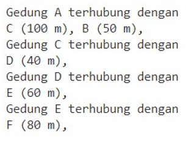

<h2 style ="font-family: calibri ; text-align: center;"> LAPORAN PRAKTIKUM ALGORITMA DAN STRUKTUR DATA   DASAR PEMROGRAMAN</h2>

 

  Nama :Sesy Tana Lina Rahmatin
 
  Kelas :TI-1H
 
  NIM : 2341720029

--------------------------------------------------------------------------------------------------------------------------
Percobaan 1

Output yang diharapkan:

Output yang berhasil:

Pertanyaan 
1.	Perbaiki kode program Anda apabila terdapat error atau hasil kompilasi kode tidak sesuai! 
2.	Pada class Graph, terdapat atribut list[] bertipe DoubleLinkedList. Sebutkan tujuan pembuatan variabel tersebut! 
3.	Jelaskan alur kerja dari method removeEdge! 
4.	Apakah alasan pemanggilan method addFirst() untuk menambahkan data, bukan method add jenis lain saat digunakan pada method addEdge pada class Graph? 
5.	Modifikasi kode program sehingga dapat dilakukan pengecekan apakah terdapat jalur antara suatu node dengan node lainnya, seperti contoh berikut (Anda dapat memanfaatkan Scanner). 

Jawaban:
1.sudah dimodifikasi dibagian method remove pada class DLL
2.untuk menyimpan beberapa vertex yang terhubung dalam graph yang sejalur 
3.Mencari asal yang sesuai dengan index yang dimasukkan kemudian mencari tujuan dari garis yang yang dihapus,kemudian menghapus vertex tujuan agar tidak terhubung dengan vertex asal
4.karena untuk menambahkan jakur diawal karena jalur pada graph tidak peduli urutan,bisa ditempatkan dimana saja
=Ouput

Percobaan 2
Output yang diharapkan:

Output yang berhasil:

Pertanyaan 
1.	Perbaiki kode program Anda apabila terdapat error atau hasil kompilasi kode tidak sesuai! 
2.	Apa jenis graph yang digunakan pada Percobaan 2? 
3.	Apa maksud dari dua baris kode berikut? 

4.	Modifikasi kode program sehingga terdapat method untuk menghitung degree, termasuk inDegree dan outDegree! 

jawaban:
1.sudah sesuai 
2.Graph menggunakan matriks dengan tipe data array
3.memanggil fungsi makeEdge untuk menambahkan data jarak dengan indeks asal dari tujuan kedalam Graph matriks
4.Output:

Latihan Praktikum 
1.	Modifikasi kode program pada class GraphMain sehingga terdapat menu program yang bersifat dinamis, setidaknya terdiri dari: 
a)	Add Edge 
b)	Remove Edge 
c)	Degree 
d)	Print Graph 
e)	Cek Edge 
= Hasil percobaan

Pengguna dapat memilih menu program melalui input Scanner 
2.	Tambahkan method updateJarak pada Percobaan 1 yang digunakan untuk mengubah jarak antara dua node asal dan tujuan! 
= kode program:
 public void updateJarak(int asal, int tujuan, int jarakBaru) {
        try {
            int index = -1;
            // Mencari index tujuan di dalam list[asal]
            for (int i = 0; i < list[asal].size(); i++) {
                if (list[asal].get(i) == tujuan) {
                    index = i;
                    break;
                }
            }
            if (index != -1) {
                // Update jarak
                list[asal].setJarak(index, jarakBaru);
                System.out.println("Jarak antara Gedung " + (char) ('A' + asal) + " dan Gedung " + (char) ('A' + tujuan)
                        + " berhasil diupdate menjadi " + jarakBaru + " meter.");
            } else {
                System.out.println(
                        "Tidak dapat memperbarui jarak: Gedung " + (char) ('A' + asal) + " tidak terhubung dengan Gedung " + (char) ('A' + tujuan));
            }
        } catch (Exception e) {
            System.out.println("Terjadi kesalahan saat memperbarui jarak: " + e.getMessage());
        }
    }

hasil Output:

3.	Tambahkan method hitungEdge untuk menghitung banyaknya edge yang terdapat di dalam graf! 
kode program:
public int hitungEdge() {
        int totalEdge = 0;
        for (int i = 0; i < vertex; i++) {
            totalEdge += list[i].size();
        }
        return totalEdge;
    }
}

hasil Output:

