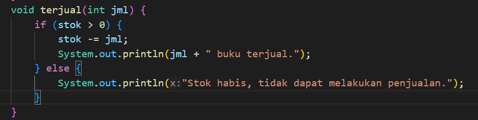

<h2 style ="font-family: calibri ; text-align: center;"> LAPORAN PRAKTIKUM ALGORITMA DAN STRUKTUR DATA   DASAR PEMROGRAMAN</h2>

 

  Nama :Sesy Tana Lina Rahmatin
 
  Kelas :TI 1H
 
  NIM : 2341720029

-------------------------------------------
 Praktikum Percobaan 1:
 source code:
 public class Buku27 {
        String judul, pengarang;
        int halaman, stok, harga, bayar, total, diskon;
    
        void tampilInformasi() {
            System.out.println("Judul                   : " + judul);
            System.out.println("Pengarang               : " + pengarang);
            System.out.println("Jumlah halaman          : " + halaman);
            System.out.println("Sisa stok               : " + stok);
            System.out.println("Harga buku              : " + harga);
           
        }
    
        void terjual(int jml) {
            if (stok > 0) {
                stok -= jml;
            }
        }
    
        void restock(int jml) {
            stok += jml;
        }
    
        void gantiHarga(int hrg) {
            harga = hrg;
        }

 Hasil Running Program
 

 pertanyaan
   1.Sebutkan dua karakteristik class atau object!
     =Atribut dan Method
   2.	Perhatikan class Buku pada Praktikum 1 tersebut, ada berapa atribut yang dimiliki oleh class Buku? Sebutkan apa saja atributnya!
     = Ada 5 yaitu judul,pengarang,halaman,stok dan harga
   3.	Ada berapa method yang dimiliki oleh class tersebut? Sebutkan apa saja methodnya!
     = Ada 4 yaitu tampilInformasi(),terjual(int jml),restock(int jml),gantiHarga(int hrg)
   4.	Perhatikan method terjual() yang terdapat di dalam class Buku. Modifikasi isi method tersebut sehingga proses pengurangan hanya dapat dilakukan jika stok masih ada (lebih besar dari 0)!
    = 
   5.	Menurut Anda, mengapa method restock() mempunyai satu parameter berupa bilangan int?
    = untuk menyatakan jumlah yang untuk ditambahkan ke dalam stok

Praktikum Percobaan 2:
source code:
public class BukuMain27 {
    public static void main(String[] args) {
        Buku27 bk1 = new Buku27();
        bk1.judul = "Today Ends Tomorrow Comes";
        bk1.pengarang = "Denanda Pratiwi";
        bk1.halaman = 198;
        bk1.stok = 13;
        bk1.harga = 71000;

        System.out.println("Informasi awal buku");
        bk1.tampilInformasi();
        bk1.terjual(5);
        bk1.gantiHarga(60000);
        bk1.tampilInformasi();
        
 Hasil Running Program
 

 pertanyaan
 1.	Pada class BukuMain, tunjukkan baris kode program yang digunakan untuk proses instansiasi! Apa nama object yang dihasilkan?
    
    =nama objek yang dihasilkan adalah bk1
2.	Bagaimana cara mengakses atribut dan method dari suatu objek?
= Menggunakan notasi titik (' . ')
3.	Mengapa hasil output pemanggilan method tampilInformasi() pertama dan kedua berbeda?
= karena adanya perubahan atribut 'stok' dan 'harga' objek 'bk1' setelah pemanggilan method 'terjual(5)' dan 'ganti harga (60000)'

Praktikum Percobaan 3:
source code:
public class Buku27 {
        String judul, pengarang;
        int halaman, stok, harga, bayar, total, diskon;
    
        void tampilInformasi() {
            System.out.println("Judul                   : " + judul);
            System.out.println("Pengarang               : " + pengarang);
            System.out.println("Jumlah halaman          : " + halaman);
            System.out.println("Sisa stok               : " + stok);
            System.out.println("Harga buku              : " + harga);
          
        }
    
        void terjual(int jml) {
            if (stok > 0) {
                stok -= jml;
            }
        }
    
        void restock(int jml) {
            stok += jml;
        }
    
        void gantiHarga(int hrg) {
            harga = hrg;
        }
    
    
        public Buku27() {
    
        }
    
        public Buku27 (String jud, String pg, int hal, int stok, int har) {
            judul = jud;
            pengarang = pg;
            halaman = hal;
            this.stok = stok;
            harga = har;
        }
        
    }
    

 Hasil Running Program
 

 pertanyaan
 1.	Pada class Buku di Percobaan 3, tunjukkan baris kode program yang digunakan untuk mendeklarasikan konstruktor berparameter!
 
 2.	Perhatikan class BukuMain. Apa sebenarnya yang dilakukan pada baris program berikut?
 
 =Dilakukan pembuatan objek baru dari class 'Buku27' dengan menggunkan konstruktor berparameter.
 3.	Hapus konstruktor default pada class Buku, kemudian compile dan run program. Bagaimana hasilnya? Jelaskan mengapa hasilnya demikian!
 
 =hasilnya error karena tidak ada konstruktor tanpa parameter yang tersedia diclass buku
 4.	Setelah melakukan instansiasi object, apakah method di dalam class Buku harus diakses secara berurutan? Jelaskan alasannya!
 =Tidak harus berurutan,dapat memanggil method diclass buku sesuai dengan kebutuhan yang diinginkan
 5.	Buat object baru dengan nama buku<NamaMahasiswa> menggunakan konstruktor berparameter dari class Buku!
 

 Latihan Praktikum
 1.Dragon.java
    public class Dragon {
    int x , y, width, height;

    void moveLeft() {
       x -= 1;
       if (x < 0) {
            detectCollision();
        }
    }
    void moveRight() {
       x += 1;
       if (x > width) {
            detectCollision();
        }
    }
    void moveUp() {
        y -= 1;
        if (y <0) {
            detectCollision();
        }
    }
    void moveDown() {
        y +=1;
        if (y > height) {
            detectCollision();
        }
    }

    void printPosition() {
        System.out.println("Posisi:(X,Y):" + x + ", " + y + ")");
    }

    void detectCollision() {
        System.out.println("Game Over");
        System.exit(0);
    }
}
    
2.DragonMain.java
  import java.util.Scanner;
public class DragonMain {

public static void main(String[] args) {
Scanner input = new Scanner(System.in);

System.out.print("Masukkan nilai awal X: ");
int x = input.nextInt();
System.out.print("Masukkan nilai awal Y: ");
int y = input.nextInt();
System.out.print("Masukkan tinggi      : ");
int height = input.nextInt();
System.out.print("Masukkan lebar       : ");
int width = input.nextInt();

Dragon koor = new Dragon ();
koor.x = x;
koor.y = y;
koor.width = width;
koor.height = height;

while (x > 0 || y > 0 || x < width | y < height) {
    System.out.print("Masukkan Perintah (A/B/C/D):");
    char perintah = input.next().charAt(0);

        switch (perintah) {
            case 'A':
                koor.moveLeft();
                break;
            case 'B':
                koor.moveRight();
                break;
            case 'C':
                koor.moveUp();
                break;
            case 'D':
                koor.moveDown();
                break;
            default:
                break;
        }
        koor.printPosition();
    }
}
}

hasil output:

