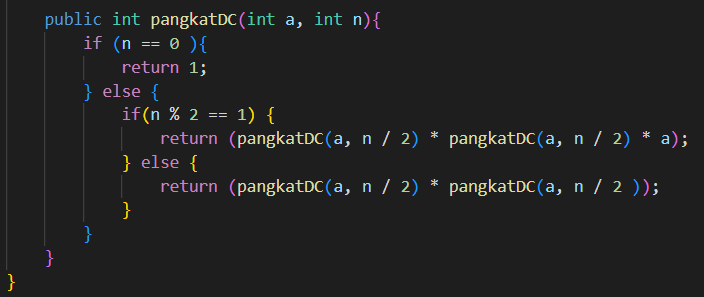

<h2 style ="font-family: calibri ; text-align: center;"> LAPORAN PRAKTIKUM ALGORITMA DAN STRUKTUR DATA   DASAR PEMROGRAMAN</h2>

 

  Nama :Sesy Tana Lina Rahmatin
 
  Kelas :TI 1H
 
  NIM : 2341720029

-------------------------------------------
Percobaan 1:
 source code:
   import java.util.Scanner;
  public class Mainfaktorial {

   public static void main(String[] args) {
    Scanner sc = new Scanner(System.in);
    System.out.println("----------------------");
    System.out.println("Masukkan jumlah elemen:");
    int iJml = sc.nextInt();

    faktorial[] fk = new faktorial[10];
    for(int i = 0; i < iJml; i++) {
        fk[i] = new faktorial();
        System.out.println("Masukkan nilai data ke-" + (i+1)+ ":");
        // int iNilai = sc.nextInt();
        fk[i].nilai = sc.nextInt();
    }

    System.out.println("HASIL - BRUTE FORCE");
    for(int i = 0; i < iJml; i++){
        System.out.println("Hasil perhitungan faktorial menggunakan Brute Force adalah " + fk[i].faktorialBF(fk[i].nilai));
    }
    
    System.out.println("HASIL - DIVIDE CONQUER");
    for(int i = 0; i < iJml; i++){
        System.out.println("Hasil perhitungan faktorial menggunakan Divide and Conquer adalah " + fk[i].faktorialDC(fk[i].nilai));
    } 
   }
}
Hasil Output:

pertanyaan
1.	Pada base line Algoritma Divide Conquer untuk melakukan pencarian nilai faktorial, jelaskan perbedaan bagian kode pada penggunaan if dan else!
=penggunaan if dalam baris tersebut adalah sebagai batas dari perulangan rekursif ,sedangkan else dalam baris tersebut sebagai baris metode rekursif
2.	Apakah memungkinkan perulangan pada method faktorialBF() dirubah selain menggunakan for?Buktikan!
=jika menggunakan metode perulangan yang lain masih bisa menggunakan metode while/do while.jika menggunakan metode rekursif akan menjadi metode divide and conquer.

3.	Jelaskan perbedaan antara fakto *= i; dan int fakto = n * faktorialDC(n-1); !
=fakto_= perkalian sederhana dengan fakto i, sedang fakto=n_faktorialD(n-1) perkalian metode rekursif yang dilakukan mencapai batas.

Percobaan 2:
 import java.util.Scanner;

public class Mainpangkat {
    public static void main(String[] args) {
        Scanner sc = new Scanner(System.in);
        System.out.println("============================");
        System.out.println("Masukkan jumlah elemen yang dihitung:");
        int elemen = sc.nextInt();

        pangkat[] png = new pangkat[elemen];
        for(int i = 0; i < elemen; i++){
            png[i] = new pangkat();
            System.out.println("Masukkan nilai yang hendak dipangkatkan: ");
            png[i].nilai = sc.nextInt();
            System.out.println("Masukkan nilai pemangkat: ");
            png[i].pangkat = sc.nextInt();

        }

        System.out.println("HASIL PANGKAT - BRUTE FORCE");
        for(int i = 0; i < elemen; i++){
            System.out.println("Hasil dari " 
            + png[i].nilai + " pangkat "
            + png[i].pangkat + " adalah "
            + png[i].pangkatBF(png[i].nilai, png[i].pangkat));
        }

        System.out.println("HASIL PANGKAT - DIVIDE AND CONQUER");
        for(int i = 0; i < elemen; i++){
            System.out.println("Hasil dari " 
            + png[i].nilai + " pangkat "
            + png[i].pangkat + " adalah "
            + png[i].pangkatDC(png[i].nilai, png[i].pangkat));
        }
    }
}
Hasil Output:

pertanyaan
1.	Jelaskan mengenai perbedaan 2 method yang dibuat yaitu PangkatBF() dan PangkatDC()!
= -pangkatBF() metode yang digunakan adalah brute force yang melakukan perkalian nilai yang dimasukkan jumlah  pangkat  sehingga jumlah pangkat mencapai batas dari pengulangan perkalian pangkat.
=-pangkatDC metode yang digunakan adalah divide and conquer yang melakukan tahapan pembagian jumlah pangkat lebih dulu kemudian menambahkan jumlah kali yang telah dimasukkan jumlah pangkay yang telah dibagi sebelumnya selanjutnya dilakukan metode rekursif untuk mengulangi tahapan sebelumnya.
2.	Apakah tahap combine sudah termasuk dalam kode tersebut?Tunjukkan!
=Tidak,Dipenggunaan metode divide and conquer adalah pembagian pangkat namun dilakukan operasi tiap bagiannya.

3.	Modifikasi kode program tersebut, anggap proses pengisian atribut dilakukan dengan konstruktor.

4.	Tambahkan menu agar salah satu method yang terpilih saja yang akan dijalankan menggunakan switch-case!

Percobaan 3:
import java.util.Scanner;
public class Mainsum {
  
    public static void main(String[] args) {
        Scanner sc = new Scanner(System.in);
            System.out.println("=================================================");
            System.out.println("Program Menghitung Keuntungan Total(satuan juta, misal 5.9)");
            System.out.print("Masukkan Jumlah Bulan : ");
            int elm = sc.nextInt();

            Sum sum = new Sum(elm);
            for(int i = 0; i < sum.elemen; i++) {
                System.out.print("Masukkan untung Bulan ke-" + (i + 1) + " = ");
                sum.keuntungan[i] = sc.nextDouble();
            }

        System.out.println("=================================================");
        System.out.println("Algoritma Brute Force");
        System.out.println( "Total Keuntungan Perusahaan Selama " + sum.elemen + " Bulan adalah = " + sum.totalBF(sum.keuntungan));
        System.out.println("=================================================");
        System.out.println("Algoritma Divide and Conquer");
        System.out.println("Total Keuntungan Perusahaan Selama " + sum.elemen + " Bulan adalah " + sum.totalDC(sum.keuntungan, 0, sum.elemen - 1));

    }
}
Hasil Output:

Pertanyaan
1.	Mengapa terdapat formulasi return value berikut?Jelaskan!

=untuk menjumlahkan masing  masing dari nilai yang sudah dimasukkan menjadi total akhir dari keuntungan perusahaan.
2.	Kenapa dibutuhkan variable mid pada method TotalDC()?
=digunakan sebagai nilai tengah dan pembagi bagian kanan juga kiri sebelum dilakukan perhitungan.
3.	Program perhitungan keuntungan suatu perusahaan ini hanya untuk satu perusahaan saja. Bagaimana cara menghitung sekaligus keuntungan beberapa bulan untuk beberapa perusahaan.(Setiap perusahaan bisa saja memiliki jumlah bulan berbeda-beda)? Buktikan dengan program!

Latihan Praktikum
Tentukan:
A.top_acceleration tertinggi menggunakan Divide and Conquer!
B.top_acceleration terendah menggunakan Divide and Conquer!
C.Rata-rata top_power dari seluruh mobil menggunakan Brute Force!

Objek
public class MainLatprak {
        public static void main(String[] args) {
           Latprak[] mobils = {
                    new Latprak("BMW", "M2 Coupe", 2016, 6816, 728),
                    new Latprak("Ford", "Fiesta ST", 2014, 3921, 575),
                    new Latprak("Nissan", "370Z", 2009, 4360, 657),
                    new Latprak("Subaru", "BRZ", 2014, 4058, 609),
                    new Latprak("Subaru", "Impreza WRX STI", 2013, 6255, 703),
                    new Latprak("Toyota", "AE86 Trueno", 1986, 3700, 553),
                    new Latprak("Toyota", "86/GT86", 2014, 4180, 609),
                    new Latprak("Volkswagen", "Golf GTI", 2014, 4180, 631)
            };
    
            Latprak showroom = new Latprak(mobils);
    
            // A. Mencari top acceleration tertinggi
            int maxAcceleration = showroom.cariMaxAcceleration();
            System.out.println("Top Acceleration Tertinggi adalah: " + maxAcceleration);
    
            // B. Mencari top acceleration teredndah
            int minAcceleration = showroom.cariMinAcceleration();
            System.out.println("Top Acceleration Terendah adalah: " + minAcceleration);
    
            // C. Menghitung rata-rata top power
            double averagePower = showroom.hitungRerataPower();
            System.out.println("Rata-rata Top Power adalah: " + averagePower);
        }
    }

Main
public class Latprak {
    Latprak[] mobils;
    String merk;
    String tipe;
    int tahun;
    int top_acceleration;
    int top_power;
    
    public Latprak(Latprak[] mobils) {
        this.mobils = mobils;
    }
    
    public Latprak(String merk, String tipe, int tahun, int top_acceleration, int top_power) {
        this.merk = merk;
        this.tipe = tipe;
        this.tahun = tahun;
        this.top_acceleration = top_acceleration;
        this.top_power = top_power;
    } 

    public int cariMaxAcceleration() {
        return cariMaxAcceleration(0, mobils.length - 1);
    }

    private int cariMaxAcceleration(int left, int right) {
        if (left == right) {
            return mobils[left].top_acceleration;
        }
        
        int mid = (left + right) / 2;
        int maxLeft = cariMaxAcceleration(left, mid);
        int maxRight = cariMaxAcceleration(mid + 1, right);
        
        return Math.max(maxLeft, maxRight);
    }

    public int cariMinAcceleration() {
        return cariMinAcceleration(0, mobils.length - 1);
    }

    private int cariMinAcceleration(int left, int right) {
        if (left == right) {
            return mobils[left].top_acceleration;
        }
        
        int mid = (left + right) / 2;
        int minLeft = cariMinAcceleration(left, mid);
        int minRight = cariMinAcceleration(mid + 1, right);
        
        return Math.min(minLeft, minRight);
    }

    public double hitungRerataPower() {
        double totalPower = 0;
        for (Latprak mobil : mobils) {
            totalPower += mobil.top_power;
        }
        return totalPower / mobils.length;
    }

}
Output

