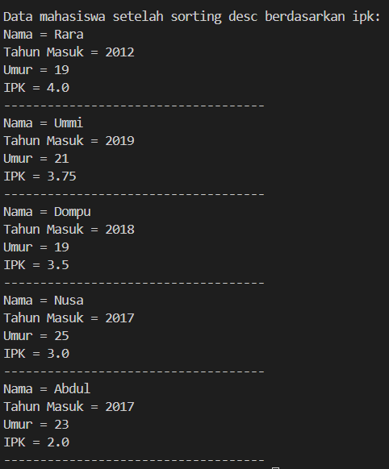
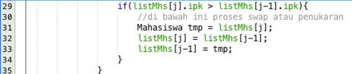
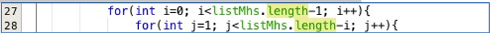
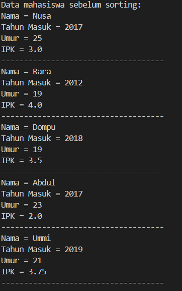
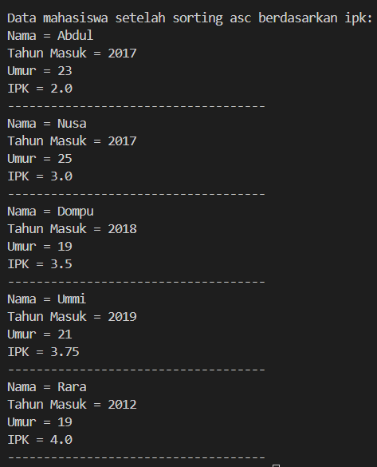
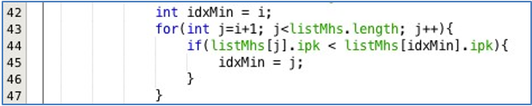
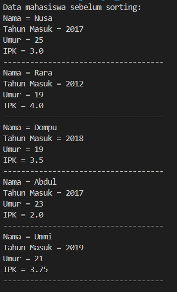
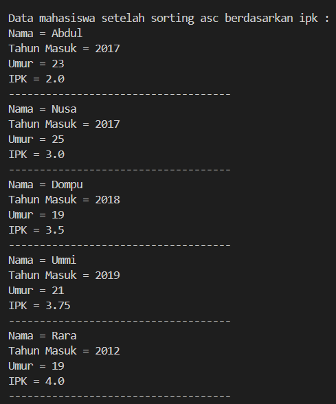
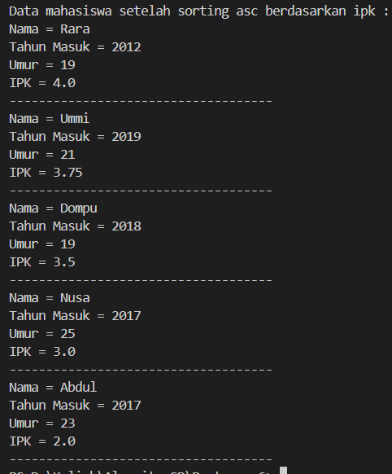
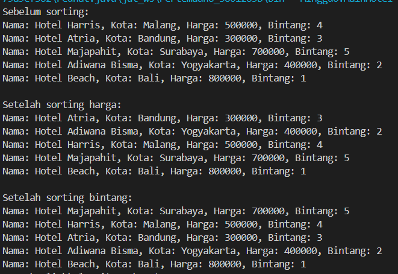

<h2 style ="font-family: calibri ; text-align: center;"> LAPORAN PRAKTIKUM ALGORITMA DAN STRUKTUR DATA   DASAR PEMROGRAMAN</h2>

 

  Nama :Sesy Tana Lina Rahmatin
 
  Kelas :TI 1H
 
  NIM : 2341720029

-------------------------------------------
Percobaan 1:
 source code:
 package  Jobsheet6;
import java.util.Scanner;
public class Mahasiswa {
    String nama;
    int thnMasuk, umur;
    double ipk;

    Mahasiswa(String n, int t, int u, double i) {
        nama = n;
        thnMasuk = t;
        umur = u;
        ipk = i;
    }

    void tampil() {
        System.out.println("Nama = " + nama);
        System.out.println("Tahun Masuk = " + thnMasuk);
        System.out.println("Umur = " + umur);
        System.out.println("IPK = " + ipk);
    }
}

class DaftarMahasiswaBerprestasi {
    Mahasiswa[] listMhs = new Mahasiswa[5];
    int idx;

    void tambah(Mahasiswa m) {
        if (idx < listMhs.length) {
            listMhs[idx] = m;
            idx++;
        } else {
            System.out.println("Data sudah penuh!!");
        }
    }

    void tampil() {
        for (Mahasiswa m : listMhs) {
            if (m != null) {
                m.tampil();
                System.out.println("------------------------------------");
            }
        }
    }

    void bubbleSort() {
        for (int i = 0; i < listMhs.length - 1; i++) {
            for (int j = 1; j < listMhs.length - i; j++) {
                if (listMhs[j] != null && listMhs[j - 1] != null) {
                    if (listMhs[j].ipk > listMhs[j - 1].ipk) {
                        Mahasiswa tmp = listMhs[j];
                        listMhs[j] = listMhs[j - 1];
                        listMhs[j - 1] = tmp;
                    }
                }
            }
        }
    }

    public static void main(String[] args) {
        DaftarMahasiswaBerprestasi list = new DaftarMahasiswaBerprestasi();
        Mahasiswa m1 = new Mahasiswa("Nusa", 2017, 25, 3);
        Mahasiswa m2 = new Mahasiswa("Rara", 2012, 19, 4);
        Mahasiswa m3 = new Mahasiswa("Dompu", 2018, 19, 3.5);
        Mahasiswa m4 = new Mahasiswa("Abdul", 2017, 23, 2);
        Mahasiswa m5 = new Mahasiswa("Ummi", 2019, 21, 3.75);

        list.tambah(m1);
        list.tambah(m2);
        list.tambah(m3);
        list.tambah(m4);
        list.tambah(m5);

        System.out.println("Data mahasiswa sebelum sorting:");
        list.tampil();

        System.out.println("\nData mahasiswa setelah sorting desc berdasarkan ipk:");
        list.bubbleSort();
        list.tampil();
    }
}
Output:

Pertanyaan 
1.	Terdapat di method apakah proses bubble sort? 
=Proses bubble sort terdapat dalam method bubbleSort() pada Class DaftarMahasiswaBerprestasi. 
2.	Di dalam method bubbleSort(), terdapat baris program seperti di bawah ini: 

    Untuk apakah proses tersebut? 
    =Proses tersebut merupakan bagian dari langkah swap dalam algoritma bubble sort. Pada bagian ini, dilakukan pengecekan apakah nilai ipk dari Mahasiswa pada indeks ke-j lebih besar dari nilai ipk Mahasiswa pada indeks ke-(j-1). Jika kondisi tersebut terpenuhi, maka dilakukan pertukaran posisi antara Mahasiswa pada indeks ke-j dengan Mahasiswa pada indeks ke-(j-1) untuk mengurutkan Mahasiswa berdasarkan nilai ipk secara menurun (descending). 
3.	Perhatikan perulangan di dalam bubbleSort() di bawah ini: 

a.	Apakah perbedaan antara kegunaan perulangan i dan perulangan j?  
=Perulangan i mengatur iterasi pada setiap fase atau langkah dalam algoritma, menandakan jumlah elemen yang telah diproses dan diurutkan, sementara perulangan j mengatur iterasi dalam satu fase tertentu, digunakan untuk membandingkan dan melakukan penukaran antara dua elemen yang berdekatan 
b.	Mengapa syarat dari perulangan i adalah i<listMhs.length-1 ? 
=Karena dalam algoritma bubble sort, setiap iterasi luar dari perulangan i akan memindahkan setidaknya satu elemen terbesar ke posisi akhir array. Oleh karena itu, saat iterasi ke-i, elemen terbesar yang telah diurutkan akan berada di posisi listMhs.length - i - 1. Dengan demikian, iterasi berikutnya tidak perlu melibatkan elemen terakhir karena sudah pasti berada di posisi yang tepat. Sehingga, perulangan luar dapat berhenti pada i < listMhs.length - 1 untuk menghindari iterasi yang tidak perlu.
c.	Mengapa syarat dari perulangan j adalah j<listMhs.length-i ? 
=Karena setiap iterasi dari perulangan luar (iterasi i) menghasilkan satu 
Mahasiswa dengan nilai ipk terbesar untuk iterasi tersebut, yang kemudian akan ditempatkan di posisi akhir dari array setelah dilakukan pengurutan. Oleh karena itu, tidak perlu membandingkan Mahasiswa di posisi akhir yang sudah terurut pada iterasi-iterasi selanjutnya. Hal ini menghindari perbandingan yang tidak perlu dan mengoptimalkan kinerja algoritma bubble sort. 
d.	Jika banyak data di dalam listMhs adalah 50, maka berapakali perulangan i  akan berlangsung? Dan ada berapa Tahap bubble sort yang ditempuh? 
= Jumlah tahapan bubble sort yang ditempuh sama dengan jumlah perulangan i. Jika jumlah data di dalam listMhs adalah 50, maka perulangan i akan berlangsung sebanyak 49 kali, dan terdapat juga 49 tahap dalam algoritma bubble sort. 

Percobaan 2:
 source code:
 class DaftarMahasiswaBerprestasi {
    Mahasiswa[] listMhs = new Mahasiswa[5];
    int idx;

    void tambah(Mahasiswa m) {
        if (idx < listMhs.length) {
            listMhs[idx] = m;
            idx++;
        } else {
            System.out.println("Data sudah penuh!!");
        }
    }

    void tampil() {
        for (Mahasiswa m : listMhs) {
            if (m != null) {
                m.tampil();
                System.out.println("------------------------------------");
            }
        }
    }

    void bubbleSort() {
        for (int i = 0; i < listMhs.length - 1; i++) {
            for (int j = 1; j < listMhs.length - i; j++) {
                if (listMhs[j] != null && listMhs[j - 1] != null) {
                    if (listMhs[j].ipk > listMhs[j - 1].ipk) {
                        Mahasiswa tmp = listMhs[j];
                        listMhs[j] = listMhs[j - 1];
                        listMhs[j - 1] = tmp;
                    }
                }
            }
        }
    }

    // Method untuk melakukan selection sort
    void selectionSort() {
        for (int i = 0; i < listMhs.length - 1; i++) {
            int idxMin = i;
            for (int j = i + 1; j < listMhs.length; j++) {
                if (listMhs[j].ipk < listMhs[idxMin].ipk) {
                    idxMin = j;
                }
            }
            // Swap
            Mahasiswa tmp = listMhs[idxMin];
            listMhs[idxMin] = listMhs[i];
            listMhs[i] = tmp;
        }
    }

    public static void main(String[] args) {
        DaftarMahasiswaBerprestasi list = new DaftarMahasiswaBerprestasi();
        Mahasiswa m1 = new Mahasiswa("Nusa", 2017, 25, 3);
        Mahasiswa m2 = new Mahasiswa("Rara", 2012, 19, 4);
        Mahasiswa m3 = new Mahasiswa("Dompu", 2018, 19, 3.5);
        Mahasiswa m4 = new Mahasiswa("Abdul", 2017, 23, 2);
        Mahasiswa m5 = new Mahasiswa("Ummi", 2019, 21, 3.75);

        list.tambah(m1);
        list.tambah(m2);
        list.tambah(m3);
        list.tambah(m4);
        list.tambah(m5);

        System.out.println("Data mahasiswa sebelum sorting:");
        list.tampil();

        // Panggil selectionSort
        System.out.println("\nData mahasiswa setelah sorting asc berdasarkan ipk:");
        list.selectionSort();
        list.tampil();
    }
}
Outout:

Pertanyaan 
1.Di dalam method selection sort, terdapat baris program seperti di bawah ini:
 
Untuk apakah proses tersebut, jelaskan! 
=Untuk menginisialisasi idxMin dengan indeks i sebagai indeks minimum awal. Kemudian dilakukan perulangan pada array dimulai dari indeks i+1 untuk mencari nilai minimum dari bagian array yang belum diurutkan. Jika nilai ipk dari Mahasiswa pada indeks j lebih kecil daripada nilai ipk Mahasiswa pada idxMin, maka idxMin akan diupdate menjadi j. Setelah selesai perulangan, idxMin akan berisi indeks dari Mahasiswa dengan nilai ipk terkecil di bagian array yang belum diurutkan. 
 

Percobaan 3:
 source code:
 class DaftarMahasiswaBerprestasi {
    Mahasiswa[] listMhs = new Mahasiswa[5];
    int idx;

    void tambah(Mahasiswa m) {
        if (idx < listMhs.length) {
            listMhs[idx] = m;
            idx++;
        } else {
            System.out.println("Data sudah penuh!!");
        }
    }

    void tampil() {
        for (Mahasiswa m : listMhs) {
            if (m != null) {
                m.tampil();
                System.out.println("------------------------------------");
            }
        }
    }

    void bubbleSort() {
        for (int i = 0; i < listMhs.length - 1; i++) {
            for (int j = 1; j < listMhs.length - i; j++) {
                if (listMhs[j] != null && listMhs[j - 1] != null) {
                    if (listMhs[j].ipk > listMhs[j - 1].ipk) {
                        Mahasiswa tmp = listMhs[j];
                        listMhs[j] = listMhs[j - 1];
                        listMhs[j - 1] = tmp;
                    }
                }
            }
        }
    }

    // Method untuk melakukan selection sort
    void selectionSort() {
        for (int i = 0; i < listMhs.length - 1; i++) {
            int idxMin = i;
            for (int j = i + 1; j < listMhs.length; j++) {
                if (listMhs[j].ipk < listMhs[idxMin].ipk) {
                    idxMin = j;
                }
            }
            // Swap
            Mahasiswa tmp = listMhs[idxMin];
            listMhs[idxMin] = listMhs[i];
            listMhs[i] = tmp;
        }
    }
    void insertionSort() {
        for (int i = 1; i < idx; i++) {
            Mahasiswa temp = listMhs[i];
            int j = i;
            while (j > 0 && listMhs[j - 1].ipk > temp.ipk) {
                listMhs[j] = listMhs[j - 1];
                j--;
            }
            listMhs[j] = temp;
        }
    }

    public static void main(String[] args) {
        DaftarMahasiswaBerprestasi list = new DaftarMahasiswaBerprestasi();
        Mahasiswa m1 = new Mahasiswa("Nusa", 2017, 25, 3);
        Mahasiswa m2 = new Mahasiswa("Rara", 2012, 19, 4);
        Mahasiswa m3 = new Mahasiswa("Dompu", 2018, 19, 3.5);
        Mahasiswa m4 = new Mahasiswa("Abdul", 2017, 23, 2);
        Mahasiswa m5 = new Mahasiswa("Ummi", 2019, 21, 3.75);

        list.tambah(m1);
        list.tambah(m2);
        list.tambah(m3);
        list.tambah(m4);
        list.tambah(m5);

        System.out.println("Data mahasiswa sebelum sorting:");
        list.tampil();

        // Panggil selectionSort
        System.out.println("\nData mahasiswa setelah sorting asc berdasarkan ipk:");
        list.selectionSort();
        list.tampil();
        // panggil insertionsort
        System.out.println("\nData mahasiswa setelah sorting asc berdasarkan ipk :");
        list.insertionSort();
        list.tampil();
    }
}
Output:

Pertanyaan 
1.Ubahlah fungsi pada InsertionSort sehingga fungsi ini dapat melaksanakan proses sorting dengan cara descending. 
= void insertionSort() {
        for (int i=1; i < listMhs.length;i++){   
            Mahasiswa temp = listMhs[i];             
            int j = i;
            while (j>0 && listMhs[j-1].ipk < temp.ipk){ 
                listMhs[j] = listMhs[j - 1];
                j--;
            }
            listMhs[j] = temp;
        }
    }

Output:

Latihan Praktikum Waktu 
Buatlah proses sorting data untuk kedua filter tersebut dengan menggunakan algoritma bubble sort dan selection sort.  
package Minggu6;
import java.util.Scanner;
public class Hotel {
    String nama;
    String kota;
    int harga;
    byte bintang;

    public Hotel(String n, String k, int h, byte b) {
        nama = n;
        kota = k;
        harga = h;
        bintang = b;
    }
    
    }
    class HotelService {
        Hotel [] rooms = new Hotel [5];
        int hitung = 0;
     
        void tambah(Hotel H) {
            if (hitung < rooms.length){
                rooms [hitung] = H;
                hitung++;
            } else {
                System.out.println( "Maaf,kamar sudah penuh");
            }
        }
        
        
        void tampilAll() {
             for (Hotel room : rooms) {
                System.out.println( "Nama: " + room.nama + ", Kota: " + room.kota + ", Harga: " + room.harga + ", Bintang: " + room.bintang);
             }
        }
    
        void bubbleSortByPrice() { 
            for (int i = 0; i < hitung - 1; i++) {             
                   int idxMax = i;
                    for (int j = i; j < hitung - i - 1; j++) {
                         if (rooms[j].harga > rooms [j + 1].harga) {
                          Hotel temp = rooms[j];
                          rooms[j] = rooms [j + 1];
                          rooms [j + 1] = temp;
                }
            }
        }
    }
          void selectionSort() {
        for (int i = 0; i < hitung - 1; i++) {
            int idxMax = i;
            for (int j = i+1; j < hitung; j++) {
                if (rooms[j].bintang > rooms [idxMax].bintang) {
                    idxMax = j;
                }
            }
            Hotel temp = rooms [idxMax]; 
            rooms [idxMax] = rooms[i];
            rooms [i] = temp;
        }
    }
}
class MainHotel { 
    public static void main(String[] args) { 
        HotelService hotelService = new HotelService(); 
        Hotel hotel1 = new Hotel("Hotel Harris", "Malang", 500000, (byte) 4); 
        Hotel hotel2 = new Hotel("Hotel Atria", "Bandung", 300000, (byte) 3); 
        Hotel hotel3 = new Hotel("Hotel Majapahit", "Surabaya", 700000, (byte) 5); 
        Hotel hotel4 = new Hotel("Hotel Adiwana Bisma", "Yogyakarta", 400000, (byte) 2); 
        Hotel hotel5 = new Hotel("Hotel Beach", "Bali", 800000, (byte) 1); 

        hotelService.tambah(hotel1); 
        hotelService.tambah(hotel2);         
        hotelService.tambah(hotel3);       
        hotelService.tambah(hotel4);        
        hotelService.tambah(hotel5); 
 
        System.out.println("Sebelum sorting:");      
        hotelService.tampilAll(); 
 
        System.out.println("\nSetelah sorting harga:");  
        hotelService.bubbleSortByPrice();     
        hotelService.tampilAll(); 
 
        System.out.println("\nSetelah sorting bintang:");     
        hotelService.selectionSort();        
        hotelService.tampilAll(); 
    } 
} 
Output:
