<h2 style ="font-family: calibri ; text-align: center;"> LAPORAN PRAKTIKUM ALGORITMA DAN STRUKTUR DATA   DASAR PEMROGRAMAN</h2>

 

  Nama :Sesy Tana Lina Rahmatin
 
  Kelas :TI 1H
 
  NIM : 2341720029

-------------------------------------------
Percobaan 1:
 source code:
 import java.util.Scanner;
 public class Buku27 {
    int kodeBuku;
    String judulBuku;
    int tahunTerbit;
    String pengarang;
    int stock;

    public Buku27(int kodeBuku, String judulBuku, int tahunTerbit, String pengarang, int stock) {
        this.kodeBuku = kodeBuku;
        this.judulBuku = judulBuku;
        this.tahunTerbit = tahunTerbit;
        this.pengarang = pengarang;
        this.stock = stock;
    }

    public void tampilDataBuku() {
        System.out.println("=========================");
        System.out.println("Kode buku: " + kodeBuku);
        System.out.println("Judul buku: " + judulBuku);
        System.out.println("Tahun Terbit: " + tahunTerbit);
        System.out.println("Pengarang : " + pengarang);
        System.out.println("Stock: " + stock);
    }

    public static class PencarianBuku {
        Buku27 listBk[] = new Buku27[5];
        int idx;

        void tambah(Buku27 m) {
            if (idx < listBk.length) {
                listBk[idx] = m;
                idx++;
            } else {
                System.out.println("Data sudah penuh!");
            }
        }

        void tampil() {
            for (Buku27 m : listBk) {
                m.tampilDataBuku();
            }
        }

        public int FindSeqSearch(int cari) {
            int posisi = -1;
            for (int j = 0; j < listBk.length; j++) {
                if (listBk[j].kodeBuku == cari) {
                    posisi = j;
                    break;
                }
            }
            return posisi;
        }

        public void Tampilpoisisi(int x, int pos) {
            if (pos != -1) {
                System.out.println("Data: " + x + " ditemukan pada indeks " + pos);
            } else {
                System.out.println("Data " + x + " tidak ditemukan");
            }
        }
    }

    public static void main(String[] args) {
        Scanner s = new Scanner(System.in);
        Scanner s1 = new Scanner(System.in);

        PencarianBuku data = new PencarianBuku();
        int jumBuku = 5;

        System.out.println("--------------------------------------------------------");
        System.out.println("Masukkan data Buku secara Urut dari KodeBuku Terkecil : ");
        for (int i = 0; i < jumBuku; i++) {
            System.out.println("-------------------");
            System.out.print("Kode Buku \t: ");
            int kodeBuku = s.nextInt();
            System.out.print("Judul buku \t: ");
            String judulBuku = s1.nextLine();
            System.out.print("Tahun Terbit \t: ");
            int tahunTerbit = s.nextInt();
            System.out.print("Pengarang \t: ");
            String pengarang = s1.nextLine();
            System.out.print("Stock     \t: ");
            int stock = s.nextInt();

            Buku27 m = new Buku27(kodeBuku, judulBuku, tahunTerbit, pengarang, stock);
            data.tambah(m);
        }

        System.out.println("---------------------------------------------------------------");
        System.out.println("Data keseluruhan Mahasiswa : ");

        System.out.println(" ------------------------------------------------------------------");
        System.out.println("Data keseluruhan Buku : ");
        data.tampil();

        System.out.println("------------------------------------------------------------------------- ");
        System.out.println("-------------------------------------------------------------------------");
        System.out.println("Pencarian Data: ");
        System.out.println("Masukkan Kode Buku yang dicari: ");
        System.out.print("Kode Buku : ");
        int cari = s.nextInt();
        System.out.println("Menggunakan sequential Search");
        int posisi = data.FindSeqSearch(cari);
        data.Tampilpoisisi(cari, posisi);
    }
}
Output:
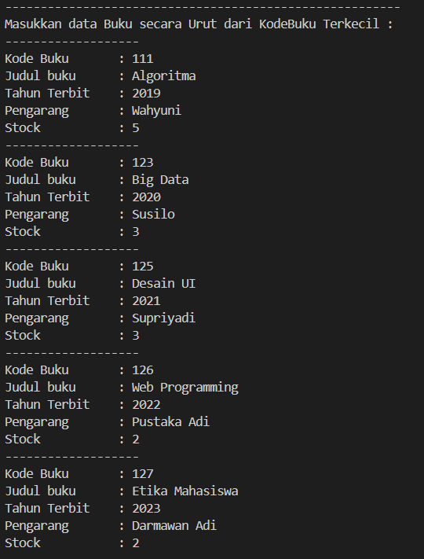
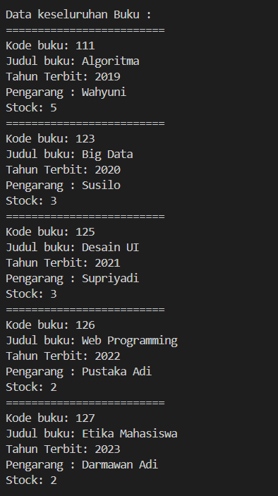
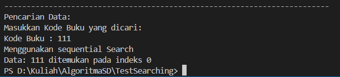

Buatlah method TampilData bertipe void pada class PencarianBukuNoAbsen dan tambahkan isi dari method TampilData. 
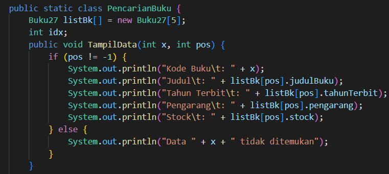
Di dalam method main(), Lakukan pemanggilan method TampilData dari class PencarianMhs. 
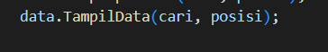
Output:
Jika Data Ditemukan:
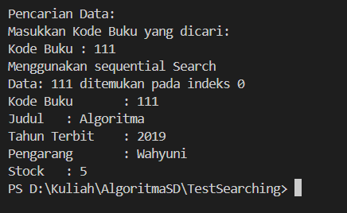
Jika Data Tidak ditemukan:
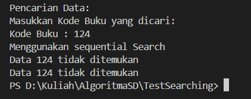
Pertanyaan 
1.	Jelaskan fungsi break yang ada pada method FindSeqSearch! 
= Digunakan Untuk Mencari Indeks dari Suatu kode buku dalam Arrray.
2. Jika Data Kode Buku yang dimasukkan tidak terurut dari kecil ke besar. Apakah program masih dapat berjalan? Apakah hasil yang dikeluarkan benar? Tunjukkan hasil screenshoot untuk bukti dengan kode Buku yang acak. Jelaskan Mengapa hal tersebut bisa terjadi?  
Hasilnya Benar,karena metode pencarian dilakukan dengan mencocokkan data yang ada ,jika data cocok maka pencarian akan berhenti.
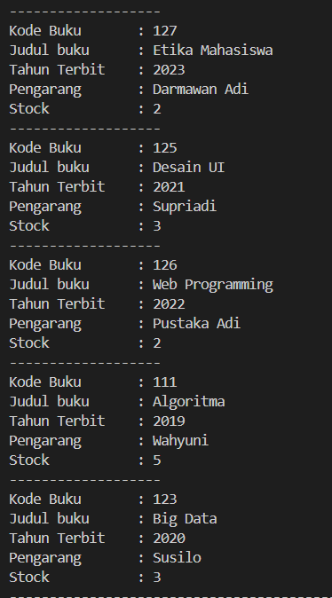
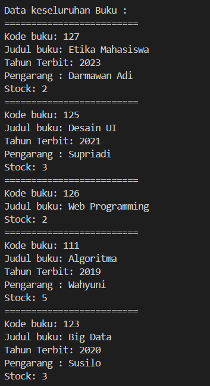
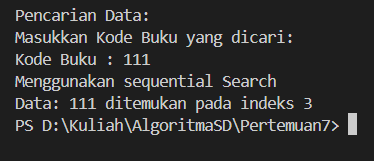
3.	Buat method baru dengan nama FindBuku menggunakan konsep sequential search dengan tipe method dari FindBuku adalah BukuNoAbsen.  Sehingga Anda bisa memanggil method tersebut pada class BukuMain seperti gambar berikut : 
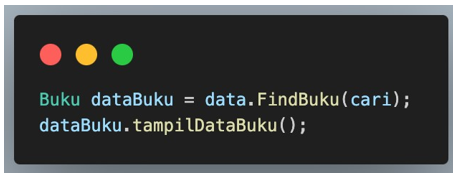

Percobaan 2:
 source code:
 public class Buku27 {
    int kodeBuku;
    String judulBuku;
    int tahunTerbit;
    String pengarang;
    int stock;

    public Buku27(int kodeBuku, String judulBuku, int tahunTerbit, String pengarang, int stock) {
        this.kodeBuku = kodeBuku;
        this.judulBuku = judulBuku;
        this.tahunTerbit = tahunTerbit;
        this.pengarang = pengarang;
        this.stock = stock;
    }

    public void tampilDataBuku() {
        System.out.println("=========================");
        System.out.println("Kode buku: " + kodeBuku);
        System.out.println("Judul buku: " + judulBuku);
        System.out.println("Tahun Terbit: " + tahunTerbit);
        System.out.println("Pengarang : " + pengarang);
        System.out.println("Stock: " + stock);
    }

    public static class PencarianBuku {
        Buku27 listBk[] = new Buku27[5];
        int idx;
        public void TampilData(int x, int pos) {
            if (pos != -1) {
                System.out.println("Kode Buku\t: " + x);
                System.out.println("Judul\t: " + listBk[pos].judulBuku);
                System.out.println("Tahun Terbit\t: " + listBk[pos].tahunTerbit);
                System.out.println("Pengarang\t: " + listBk[pos].pengarang);
                System.out.println("Stock\t: " + listBk[pos].stock);
            } else {
                System.out.println("Data " + x + " tidak ditemukan");
            }
        }
        public int FindBinarySearch(int cari, int left, int right) {
            if (right >= left) {
                int mid = left + (right - left) / 2;
                if (listBk[mid] != null && listBk[mid].kodeBuku == cari) {
                    return mid;
                } else if (listBk[mid] != null && listBk[mid].kodeBuku > cari) {
                    return FindBinarySearch(cari, left, mid - 1);
                } else {
                    return FindBinarySearch(cari, mid + 1, right);
                }
            }
            return -1;
        }
        

        void tambah(Buku27 m) {
            if (idx < listBk.length) {
                listBk[idx] = m;
                idx++;
            } else {
                System.out.println("Data sudah penuh!");
            }
        }

        void tampil() {
            for (Buku27 m : listBk) {
                m.tampilDataBuku();
            }
        }

        public int FindSeqSearch(int cari) {
            int posisi = -1;
            for (int j = 0; j < listBk.length; j++) {
                if (listBk[j].kodeBuku == cari) {
                    posisi = j;
                    break;
                }
            }
            return posisi;
        }

        public void Tampilpoisisi(int x, int pos) {
            if (pos != -1) {
                System.out.println("Data: " + x + " ditemukan pada indeks " + pos);
            } else {
                System.out.println("Data " + x + " tidak ditemukan");
            }
        }
    }

    public static void main(String[] args) {
        Scanner s = new Scanner(System.in);
        Scanner s1 = new Scanner(System.in);

        PencarianBuku data = new PencarianBuku();
        int jumBuku = 5;

        System.out.println("--------------------------------------------------------");
        System.out.println("Masukkan data Buku secara Urut dari KodeBuku Terkecil : ");
        for (int i = 0; i < jumBuku; i++) {
            System.out.println("-------------------");
            System.out.print("Kode Buku \t: ");
            int kodeBuku = s.nextInt();
            System.out.print("Judul buku \t: ");
            String judulBuku = s1.nextLine();
            System.out.print("Tahun Terbit \t: ");
            int tahunTerbit = s.nextInt();
            System.out.print("Pengarang \t: ");
            String pengarang = s1.nextLine();
            System.out.print("Stock     \t: ");
            int stock = s.nextInt();

            Buku27 m = new Buku27(kodeBuku, judulBuku, tahunTerbit, pengarang, stock);
            data.tambah(m);
        }

        System.out.println("---------------------------------------------------------------");
        System.out.println("Data keseluruhan Mahasiswa : ");

        System.out.println(" ------------------------------------------------------------------");
        System.out.println("Data keseluruhan Buku : ");
        data.tampil();

        System.out.println("------------------------------------------------------------------------- ");
        System.out.println("-------------------------------------------------------------------------");
        System.out.println("Pencarian Data: ");
        System.out.println("Masukkan Kode Buku yang dicari: ");
        System.out.print("Kode Buku : ");
        int cari = s.nextInt();
        System.out.println("Menggunakan sequential Search");
        int posisi = data.FindSeqSearch(cari);
        data.Tampilpoisisi(cari, posisi);
        data.TampilData(cari, posisi);
        
        System.out.println("===========================");
        System.out.println("Menggunakan binary Search");
        posisi = data.FindBinarySearch(cari, 0, jumBuku - 1);
        data.Tampilpoisisi(cari, posisi);
        data.TampilData(cari, posisi);
    }
    }

Output:
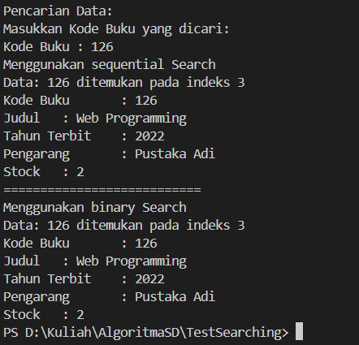
Pertanyaan
1.	Tunjukkan pada kode program yang mana proses divide dijalankan! 
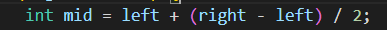
2.	Tunjukkan pada kode program yang mana proses conquer dijalankan! 
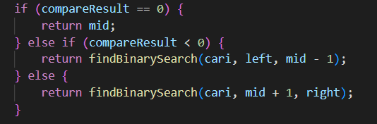
3. Jika data Kode Buku yang dimasukkan tidak urut. Apakah program masih dapat berjalan? Mengapa demikian! Tunjukkan hasil screenshoot untuk bukti dengan kode Buku yang acak. Jelaskan Mengapa hal tersebut bisa terjadi?  
=Masih Bisa Berjalan tanpa ada masalah.
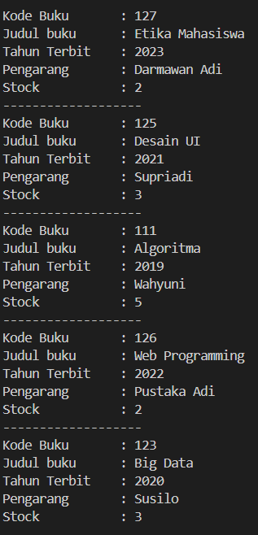
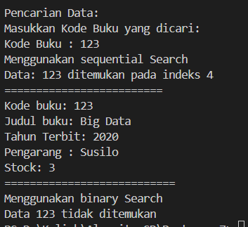
4.  Jika Kode Buku yang dimasukkan dari Kode Buku terbesar ke terkecil (missal : 20215, 20214, 20212, 20211, 20210) dan elemen yang dicari adalah 20210. Bagaimana hasil dari binary search? 
Apakah sesuai? Jika tidak sesuai maka ubahlah kode program binary seach agar hasilnya sesuai! 
=Hasil yang dijalankan tidak sesuai karena kode belum memenuhi metode binary search yang dilakukan sorting terlebih dahulu.
dibawah ini kode inertion sort untuk melakukan sorting pada metode binary search
void insertionSortAsc(){
     for ( int i = 1; i < listBk.length; i++) {
          Buku27 temp = listBK [i];
             int j = i;
                while (j > 0 && listBk[j - 1].kdBuku > temp.kdBuku) {
                    listBk[j] = listBk[j-1];
                    j--;
                }
                listBk[j] = temp;
            }
        }

Percobaan 3:
 source code:
 Percobaan 2:
 
public class MergeSorting27 {
    public void mergeSort(int[] data) {
        sort(data, 0, data.length - 1);
    }

    public void merge(int data[], int left, int middle, int right) {
        int[] temp = new int[data.length];
        for (int i = left; i <= right; i++) {
            temp[i] = data[i];
        }

        int a = left;
        int b = middle + 1;
        int c = left;

        while (a <= middle && b <= right) {
            if (temp[a] <= temp[b]) {
                data[c] = temp[a];
                a++;
            } else {
                data[c] = temp[b];
                b++;
            }
            c++;
        }

        int s = middle - a;
        for (int i = 0; i <= s; i++) {
            data[c + i] = temp[a + i];
        }
    }

    public void sort(int data[], int left, int right) {
        if (left < right) {
            int middle = (left + right) / 2;
            sort(data, left, middle);
            sort(data, middle + 1, right);
            merge(data, left, middle, right);
        }
    }

    public void printArray(int arr[]) {
        for (int i = 0; i < arr.length; i++) {
            System.out.print(arr[i] + " ");
        }
        System.out.println();
    }
    public static void main(String[] args) {
        int data[] = {10, 40, 30, 50, 70, 20, 100, 90};
        System.out.println("Sorting dengan merge sort");
        MergeSorting27 mSort = new MergeSorting27();
        System.out.println("Data awal:");
        mSort.printArray(data);
        mSort.mergeSort(data);
        System.out.println("Setelah diurutkan:");
        mSort.printArray(data);
    }
}

Output:
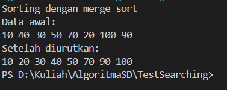

Latihan Praktikum 
1.	Modifikasi percobaan searching diatas dengan ketentuan berikut ini 
-	Ubah tipe data dari kode Buku yang awalnya int menjadi String 
    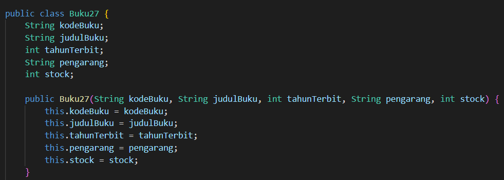
-	Tambahkan method untuk pencarian kode Buku (bertipe data String) dengan menggunakan sequential search dan binary search
    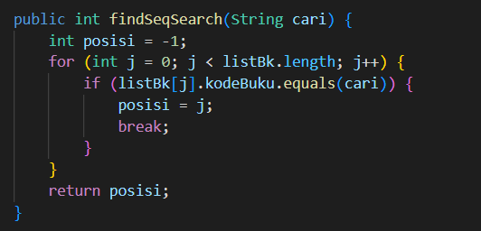
    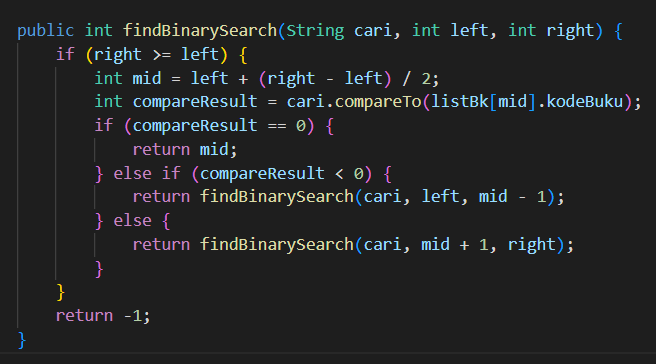
Output
 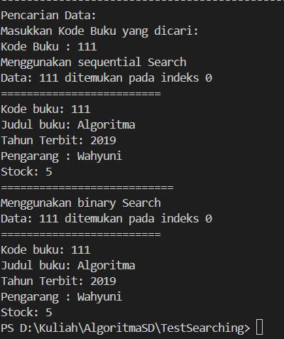

2.	Modifikasi percobaan searching diatas dengan ketentuan berikut ini 
-	Tambahkan method pencarian judul buku menggunakan sequential search dan binary search. Sebelum dilakukan searching dengan binary search data harus dilakukan pengurutan dengan menggunakan algoritma Sorting (bebas pilih algoritma sorting apapun)! Sehingga ketika input data acak, maka algoritma searching akan tetap berjalan 
-Sequential Search
Buku27 findbuku(String find) {
      int awal = -1;
      for (int i = 0; i < listBk.length; i++) {
          if (find.equalsIgnoreCase(listBk[i].judulBuku)) {
              awal = i;
              break;
          }
      }
      return listBk[awal];
  }
-Binarry search
void StrInsertionSortJudulAsc() {
      for (int i = 1; i < listBk.length; i++) {
          Buku13 temp = listBk[i];
          int j = i;
          while (j > 0 && listBk[j - 1].judulBuku.compareTo(temp.judulBuku) > 0) {
              listBk[j] = listBk[j - 1];
              j--;
          }
          listBk[j] = temp;
      }
  }

  public int StrFindBukuBinary(String cari, int l, int r) {
      int m;
      if (r >= l) {
          m = (l + r) / 2;
          if (cari.compareToIgnoreCase(listBk[m].judulBuku) == 0) {
              return m;
          } else if (cari.compareToIgnoreCase(listBk[m].judulBuku) < 0) {
              return StrFindBukuBinary(cari, l, m - 1);
          } else {
              return StrFindBukuBinary(cari, m + 1, r);
          }
      }
      return -1;
  }
Output

-	Buat aturan untuk mendeteksi hasil pencarian judul buku yang lebih dari 1 hasil dalam bentuk kalimat peringatan! Pastikan algoritma yang diterapkan sesuai dengan kasus yang diberikan! 

public int judulDobel(String cari) {
      int hitung = 0;
      for (int i = 0; i < listBk.length; i++) {
          if (listBk[i].judulBuku != null && listBk[i].judulBuku.equalsIgnoreCase(cari)) {
              hitung++;
          }
      }
      return hitung;
  }
Output:
