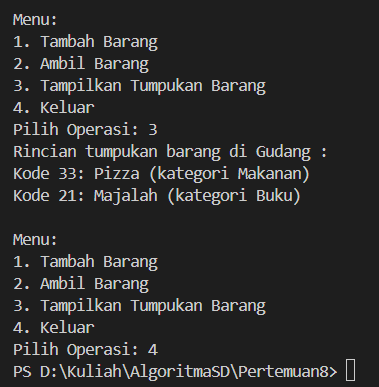
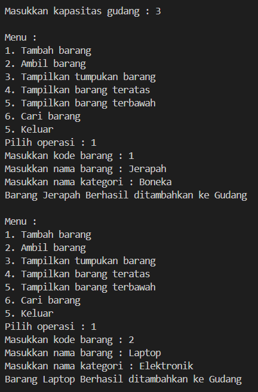

<h2 style ="font-family: calibri ; text-align: center;"> LAPORAN PRAKTIKUM ALGORITMA DAN STRUKTUR DATA   DASAR PEMROGRAMAN</h2>

 

  Nama :Sesy Tana Lina Rahmatin
 
  Kelas :TI 1H
 
  NIM : 2341720029

-------------------------------------------
Percobaan 1: Penyimpanan Tumpukan Barang Dalam Gudang
1.Class Barang
package P8;
public class Barang27 { 
     
    int kode; 
    String nama, kategori; 
 
    Barang27(int kode, String nama, String kategori) {     
        this.kode = kode ;        
        this.nama = nama ; 
        this.kategori = kategori ; 
    } 
} 

2.Class Gudang
package P8;
public class Gudang27 {
    Barang27[] tumpukan;    
    int size;    
    int top; 

    
    public Gudang27(int kapasitas) {       
        size = kapasitas;        
        tumpukan = new Barang27[size];        
        top = -1; 
    } 

    public boolean cekKosong() {  
        if (top == -1) {           
            return true ; 
        } else { 
            return false; 
        }   
    } 
     public boolean cekPenuh() {      
        if (top == size - 1) {           
            return true; 
        } else { 
            return false; 
        } 
    } 

    public void tambahBarang (Barang27 brg) {  
        if (! cekPenuh()) {        
            top++ ; 
            tumpukan [top] = brg; 
            System.out.println("Barang " +  brg.nama +  " Berhasil ditambahkan ke Gudang"); 
        }else { 
            System.out.println("Gagal!! Tumpukan barang di Gudang sudah penuh"); 
        } 
    }  
    
    public Barang27 ambilBarang() {   
        if (!cekKosong()) { 
            Barang27 delete = tumpukan[top];    
            top--; 
            System.out.println("Barang "  +  delete.nama +  " diambil dari Gudang. ");           
            return delete;           
        }else { 
            System.out.println("Tumpukan barang kosong.");           
            return  null; 
        }     
    }  
    public Barang27 lihatBarangTeratas () {      
        if (!cekKosong()) { //(!isEmpty())           
            Barang27 barangTeratas = tumpukan[top]; 
            System.out.println("Barang teratas: " + barangTeratas.nama);        
            return barangTeratas;   
        }else { 
            System.out.println("Tumpukan barang kosong.");             
            return null; 
        }   
    } 
    public void tampilkanBarang() {        
         if (! cekKosong()) { 
            System.out.println("Rincian tumpukan barang di Gudang :");          
            for (int i = top; i >= 0; i--) { 
                 System.out.printf("Kode %d: %s (kategori %s)\n", tumpukan[i].kode, tumpukan[i].nama,
                         tumpukan[i].kategori); 
             } 
        }else { 
            System.out.println("Tumpukan Barang kosong."); 
        } 
   } 
}

3.Class Utama
package P8;
import java.util.Scanner;
public class Utama27 {
    public static void main(String[] args) { 
        Scanner sc27 = new Scanner (System.in);         
        Gudang27 gudang = new Gudang27(7);        
        boolean ulang = true;         
        while (ulang) { 
            System.out.println("\nMenu:");  
            System.out.println("1. Tambah Barang");  
            System.out.println("2. Ambil Barang");  
            System.out.println("3. Tampilkan Tumpukan Barang");  
            System.out.println("4. Keluar");            
            System.out.print("Pilih Operasi: ");             
            int pilihan = sc27.nextInt();            
            sc27.nextLine();
            switch (pilihan) {               
                case 1: 
                    System.out.print("Masukkan kode barang : ");         
                    int kode = sc27.nextInt();                    
                    sc27.nextLine(); 
                    System.out.print("Masukkan nama barang : "); 
                    String nama = sc27.nextLine(); 
                    System.out.print("Masukkan nama kategori : "); 
                    String kategori = sc27.nextLine(); 
                    Barang27 barangbaru = new Barang27 (kode, nama, kategori);                   
                    gudang. tambahBarang(barangbaru);                 
                    break;
                case 2 :                      
                    gudang.ambilBarang();                      
                    break;                  
                case 3:                      
                    gudang.tampilkanBarang();      
                    break;  
                case 4:                    
                    ulang = false;                    
                    break;               
                default : 
                    System.out.println("Pilihan tidak valid. Silahkan coba lagi."); 
                }   
            } 
        }    
    } 
     
Hasil Running:

Pertanyaan 
1.	Lakukan perbaikan pada kode program, sehingga keluaran yang dihasilkan sama dengan verifikasi hasil percobaan! Bagian mana saja yang perlu diperbaiki? 
=Pada Method tampilkanBarang() : 
Before 

After

2.	Berapa banyak data barang yang dapat ditampung di dalam tumpukan? Tunjukkan potongan kode programnya! 
=Pada class Utama27 telah ditentukan sebanyak 7 kapasitas

3.	Mengapa perlu pengecekan kondisi !cekKosong() pada method tampilkanBarang? Kalau kondisi tersebut dihapus, apa dampaknya? 
=untuk memastikan apakah tumpukan tersebut kosong atau tidak  sebelum menampilkan barang. Jika menghapus kondisi !cekKosong()  output pada program akan menampilkan Tumpukan Barang Kosong 

4.	Modifikasi kode program pada class Utama sehingga pengguna juga dapat memilih operasi lihat barang teratas, serta dapat secara bebas menentukan kapasitas gudang! 

5.	Commit dan push kode program ke Github 

Percobaan 2: Konversi Kode Barang ke Biner 
package P8;

public class StackKonversi27 {
    int size ;   
    int[] tumpukanBiner;     
    int top; 
 
    public StackKonversi27() {         
        this.size = 32;  
        tumpukanBiner = new int[size];        
        top = -1; 
    }  

    public boolean isEmpty() {        
         return top == -1; 
    }  

    public boolean isFull() {         
        return top == size -1 ; 

    }
    public void push (int data) {         
        if (isFull()) { 
            System.out.println("Stack penuh"); 
        }else {            
            top++;             
            tumpukanBiner[top] = data; 
        }    
    }    
    public int pop(){        
        if (isEmpty()) { 
            System.out.println("Stack kosong");             
            return -1;        
        }else {             
            int data = tumpukanBiner[top];            
            top--;             
            return data; 
        } 
    } 
} 

package P8;
public class Gudang27 {
    Barang27[] tumpukan;    
    int size;    
    int top; 

    
    public Gudang27(int kapasitas) {       
        size = kapasitas;        
        tumpukan = new Barang27[size];        
        top = -1; 
    } 

    public boolean cekKosong() {  
        if (top == -1) {           
            return true ; 
        } else { 
            return false; 
        }   
    } 
     public boolean cekPenuh() {      
        if (top == size - 1) {           
            return true; 
        } else { 
            return false; 
        } 
    } 

    public void tambahBarang (Barang27 brg) {  
        if (! cekPenuh()) {        
            top++ ; 
            tumpukan [top] = brg; 
            System.out.println("Barang " +  brg.nama +  " Berhasil ditambahkan ke Gudang"); 
        }else { 
            System.out.println("Gagal!! Tumpukan barang di Gudang sudah penuh"); 
        } 
    }  
    
    public Barang27 ambilBarang() {   
        if (!cekKosong()) { 
            Barang27 delete = tumpukan[top];    
            top--; 
            System.out.println("Barang "  +  delete.nama +  " diambil dari Gudang. ");           
            System.out.println("Kode unik dalam biner : " + konversiDesimalkeBiner(delete.kode));  
            return delete;           
        }else { 
            System.out.println("Tumpukan barang kosong.");            
            return  null; 
        }     
    } 
    
    public String konversiDesimalkeBiner(int kode) {        
        StackKonversi27 stack = new StackKonversi27();        
        while (kode > 0) {             
            int sisa = kode % 2;             
            stack.push(sisa);             
            kode = kode /2; 
        } 
        String biner = new String();         
        while(!stack.isEmpty()) {             
            biner += stack.pop(); 
        }         
        return biner; 
    }
      
    public Barang27 lihatBarangTeratas () {      
        if (!cekKosong()) { //(!isEmpty())           
            Barang27 barangTeratas = tumpukan[top]; 
            System.out.println("Barang teratas: " + barangTeratas.nama);        
            return barangTeratas;   
        }else { 
            System.out.println("Tumpukan barang kosong.");             
            return null; 
        }   
    } 
    public void tampilkanBarang() {        
         if (! cekKosong()) { 
            System.out.println("Rincian tumpukan barang di Gudang :");          
            for (int i = top; i >= 0; i--) { 
                 System.out.printf("Kode %d: %s (kategori %s)\n", tumpukan[i].kode, tumpukan[i].nama,
                         tumpukan[i].kategori); 
             } 
        }else { 
            System.out.println("Tumpukan Barang kosong."); 
        } 
   } 
}

Hasil Running:

Pertanyaan 
1.	Pada method konversiDesimalKeBiner, ubah kondisi perulangan menjadi while (kode != 0), bagaimana hasilnya? Jelaskan alasannya! 

= Outputnya tetap sama, karena kode > 0 fungsinya sama dengan != 0 
2.	Jelaskan alur kerja dari method konversiDesimalKeBiner! 
•	Method  
‘konversiDesimalKeBiner(int kode)’  
menerima parameter ‘kode’ yang merupakan bilangan desimal  yang akan dikonversi menjadi biner.  
•	Objek ‘StackKonversi02’. Untuk menampung sementara hasil  sementara hasil konversi.  
•	Loop ‘while’ dengan ‘kode’ tidak sama dengan 0.  Menghitung sisa ‘kode’ (modulo 2). Adalah bit terakhir  representasi biner dari bilangan desimal.  
Hasil sisa ditambahkan ke dalam stack dengan metode ‘push’  
dari class ‘StackKonversi02’  
‘kode’ dibagi dengan 2  
•	‘biner’ dideklarasikan sebagai String kosong  
•	Loop ‘while’ berjalan selama stack tidak kosong  
Bit ditambahkan ke dalam stack menggunakan metode ‘pop’   
Bit ditambahkan ke String ‘biner’  
•	Setelah stack kosong , String ‘biner’ berisi representasi biner dari  bilangan desimal awal dikembalikan sebagai hasil konversi. 

Percobaan 3: Konversi Notasi Infix ke Postfix 
package P8;

public class PostFix27 {
    int n, top;
    char[] stack;

    public PostFix27(int total) {
        n = total;
        top = -1;
        stack = new char[n];
        push('(');
    }

    public void push(char c) {
        top++;
        stack[top] = c;
    }

    public char pop() {
        char item = stack[top];
        top--;
        return item;
    }

    public boolean isOperand(char c) {
        if ((c >= 'A' && c <= 'z') || (c >= 'a' && c <= 'z')
                || (c >= '0' && c <= '9') || (c == ' ' && c == '.')) {
            return true;
        } else {
            return false;
        }
    }

    public boolean isOperator(char c) {
        if (c == '^' || c == '%' || c == '/' || c == '*' || c == '-' || c == '+') {
            return true;
        } else {
            return false;
        }
    }

    public int derajat(char c) {
        switch (c) {
            case '^':
                return 3;
            case '%':
                return 2;
            case '/':
                return 2;
            case '*':
                return 2;
            case '-':
                return 1;
            case '+':
                return 1;
            default:
                return 0;
        }
    }

    public String konversi(String Q) {
        String P = "";
        char c;
        for (int i = 0; i < n; i++) {
            c = Q.charAt(i);
            if (isOperand(c)) {
                P = P + c;
            }
            if (c == '(') {
                push(c);
            }
            if (c == ')') {
                while (stack[top] != '(') {
                    P = P + pop();
                }
                pop();
            }
            if(isOperator(c)){
                while (derajat(stack[top]) >= derajat (c)){
                    P = P + pop();
                }
                push(c);
            }
        }
        return P;
    }
}

package P8;
import java.util.Scanner;
public class PostfixMain27 {

    public static void main(String[] args) { 
        Scanner sc27 = new Scanner(System.in);  
        String P, Q;  
        System.out.println("Masukkan ekspresi matematika (infix) : ");  
        Q = sc27.nextLine();  
        Q = Q.trim(); 
        Q = Q + ")";  

       int total = Q.length();
       PostFix27 post = new PostFix27(total);  
       P = post.konversi(Q);  
       System.out.println("Postfix: " + P ) ;
    }
}
      
Hasil Running:

Pertanyaan 
1.	Pada method derajat, mengapa return value beberapa case bernilai sama? Apabila return value diubah dengan nilai berbeda-beda setiap case-nya, apa yang terjadi? 
=Karena terdapat beberapa karakter mempunyai bobot sama. Jika  return value diubah, maka urutan operator bisa jadi tidak sesuai dengan  aslinya saat proses konversi ke bentuk postfix. 

Hasil Running:

2.	Jelaskan alur kerja method konversi! 
=a.	Fungsi konversi menerima String Q (infix) dan mengembalikan  
String P (postfix)  
b.	String P kosong untuk menampung hasil postfix   
c.	Variabel c menyimpan karakter yang diproses   
d.	Loop for memproses setiap karakter dalam String Q  
e.	Jika c adalah operand, tambahkan ke String P  
f.	Jika c adalah ( masukkan ke stack  
g.	Jika c adalah ) keluarkan seluruh operator dari stack ke P sampai  menemukan (  
h.	Keluarkan ( dari stack  
i.	Jika c adalah operator , maka keluarkan semua operator ke P yang  lebih tinggi dari operator c  
j.	Masukkan operator c ke dalam stack  
k.	Jika seluruh karakter sudah terproses, keluarkan semua operator yang  tersisa dari stack ke string P  
l.	Kembalikan String P sebagai representasi postfix dari infix 
3.	Pada method konversi, apa fungsi dari potongan kode berikut? 

=Potongan kode tersebut berfungsi untuk mengambil karakter dari  indeks i dari String Q dan disimpan pada variabel c. 

 Latihan Praktikum 
Perhatikan dan gunakan kembali kode program pada Percobaan 1. Tambahkan dua method berikut pada class Gudang: 
•	Method lihatBarangTerbawah digunakan untuk mengecek barang pada tumpukan terbawah 

•	Method cariBarang digunakan untuk mencari ada atau tidaknya barang berdasarkan kode barangnya atau nama barangnya 

Hasil Running:

